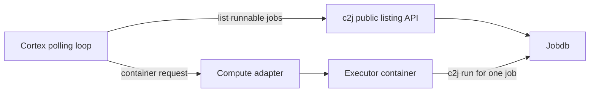
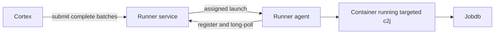

# Cortex design

Status: architecture for the initial Go implementation. See [README.md](README.md) for implemented behavior, configuration, validation, and deployment limitations. The [execution tracking guide](GUIDE-Execution-Tracking.md) describes the c2j contract.

**Runtime requirement changes are handled by c2j.** Cortex provisions from published demand and advertises the requested, provider-guaranteed allocation. There is no additional Cortex mechanism or outstanding c2j feature request for this behavior.

## Purpose

Cortex supplies compute for c2j jobs that are ready to run. It periodically lists runnable jobs in an explicitly configured set of repository cells, picks individual jobs, reads their current execution requirements, and starts containers through a generic compute interface. Planned adapters include local Docker, remote providers using a standard OpenAPI protocol, Google Cloud Run Jobs, Amazon ECS tasks, and Azure Container Apps Jobs.

**Cortex has no persisted state.** Its scheduling memory consists of a short-lived cooldown keyed by job identity, submissions currently in progress, and round-robin cursors for equally preferred services. Jobdb holds job state; c2j handles discovery and execution; providers hold compute resources and their correlation metadata.

The local Docker adapter additionally uses transient admission reservations and reconstructs committed capacity from Docker's container records. This does not introduce a Cortex database.

The design assumes executors normally start and acquire a lease within a configurable interval `X`. Occasional duplicate launches are acceptable. The cooldown reduces unnecessary launches; jobdb leases govern whether an executor can do work.

## Responsibilities

| Component | Responsibility |
| --- | --- |
| Jobdb | Persist jobs, progress, opaque continuation payloads, and results; enforce leases and atomic rescheduling. It does not match resource requirements. |
| c2j | Publish effective execution demand, resolve recipes, acquire leases, preflight actual allocation, execute or suspend work, and preserve accepted requirement changes. |
| Cortex | Poll c2j, resolve execution requirements against defaults, apply the cooldown, and request compute. |
| Compute adapter | Resolve image/platform and provider sizing, report usable allocation, launch that exact container configuration, and attach correlation metadata. |
| Executor container | Run `c2j run` for the specific job supplied by Cortex. |

Cortex uses c2j’s public `pkg/joblist` Go API for discovery. The API accepts public JobDB filter types, but c2j owns query construction, remote access, and execution projection. Recipe interpretation, dependency handling, lease operations, and application retries stay in c2j/jobdb.



## Integration contract and availability

The controller uses `github.com/colony-2/c2j/pkg/joblist` for all discovery. See [the feature response](C2J_FEATURE_REQUESTS_RESPONSE.md) for the public API contract. It requires explicit repository identities and does not discover local checkouts or resolve aliases. Listing does not initialize an executor or claim work. Executor containers still run the c2j CLI.

Use [GUIDE-Execution-Tracking.md](GUIDE-Execution-Tracking.md) for the command contract and [C2J_PORTABLE_EXECUTION_REQUIREMENTS_DESIGN.md](C2J_PORTABLE_EXECUTION_REQUIREMENTS_DESIGN.md) for design background. Requirement-change handling belongs entirely to c2j; older descriptions of unconditional yielding do not establish an outstanding integration requirement.

The updated guide documents recipe requirements, submission overrides, actual allocation flags/environment variables, execution preflight, durable environment handoffs, operation directives, and the enriched list view as available. These provide the underlying contract Cortex needs; cloud provisioning remains Cortex's responsibility. Pin compatible controller, container c2j, and JobDB versions and verify their integration. The guide requires fresh format-3 JobDB storage and reports no in-place migration of old jobs/history; adopting it is a deployment prerequisite, not a Cortex migration responsibility.

The public API returns typed pages from a reusable client per connection/tenant. Query recipe jobs in `READY` or `CRASH_CONCERN` status for the configured repository, with page size 100.

Repeat this for each configured repository, advancing the opaque continuation token within configured page limits. Recipe execution remains targeted with `c2j run --job-id`; Cortex never asks a launched container to select unrelated work.

### Discovery and typed routes

The library returns typed jobs and `NextPageToken`. Retain job identity, status, next route, execution view, and availability information. Listing does not claim work, and a candidate can change before its container starts. c2j makes the authoritative lease/readiness check during targeted execution.

Read `next_route` as independent `jobType` and optional `taskType` fields. `{"jobType":"recipe"}` requests recipe job work; a task route requests that specific task. Identifiers are case-sensitive opaque strings and may contain colons, commas, or spaces. Do not parse the old capability-string format. `--job-type` takes one identifier per flag; `--waiting-for` takes a complete JSON task route per flag.

`READY` alone is insufficient: human-input tasks can also be ready. Launch only routes supported by the selected executor. The initial scope is recipe job work; additional automated task routes require explicit support in the executor configuration. Skip unsupported routes with a diagnostic instead of repeatedly starting containers that cannot handle them. Cortex does not handle human input or derive the current route from `task_wait.resumeJobType`.

`client_payload` is client-owned state, separate from job metadata and scheduling state. Cortex uses c2j's `execution` projection instead of interpreting raw payload keys. `client_payload_revision` counts payload updates, not attempts; it never changes the cooldown key.

## Read effective demand through c2j

Cortex consumes the list entry's `execution` view: `status`, `source`, `published`, `demand`, and the initial snapshot when available. `execution.demand.effective` supplies the current known requirements. Sources are `submission`, `yield`, and `absent`; statuses are `specified`, `unspecified`, `unresolved`, `malformed`, and `unsupported`. The listing is the boundary: Cortex does not query JobDB directly, load recipe artifacts, resolve recipe sources, or replay chapters.

c2j owns the overlay and read precedence:

- Job-level requirement fields override the corresponding pinned recipe-base fields.
- The latest validated current snapshot takes precedence over immutable initial submission hints. A reschedule payload contains a full snapshot, not just the most recent patch.
- The current projection describes submission/latest-handoff snapshots. A deferred recipe that completes without yielding can still appear `unresolved`; this is not a reason to launch a completed job. `last_handoff_allocation` is historical and must never supply allocation facts for a new attempt.
- Deployment defaults fill omitted fields only after that overlay; they are not written back to the recipe or job requirements.

Cortex uses the published values instead of interpreting raw payloads or task history. Listings need not reflect requirement changes satisfied by a running executor. Those changes are recorded in the task steps and recovered by c2j during replay. A replacement launched from an older published snapshot may need one further handoff if replay discovers requirements it cannot satisfy.

| Listing state | Cortex action |
| --- | --- |
| `specified`, from submission or yield | Provision from `demand.effective`; fill unspecified fields from defaults. |
| `unresolved` | Bootstrap using defaults for missing facts and retain any explicit valid known overrides. c2j resolves the recipe inside the executor. |
| `unspecified` | Use the configured default environment. |
| `malformed`, `unsupported`, inconsistent snapshot, or retrieval error | Report the error and skip the affected job; never reinterpret it as an empty demand. |
| Missing execution view or unknown status | Report an incompatible response contract; do not silently treat it as an unconstrained job. |

**Do not filter discovery by the default executor's allocation.** Cortex is selecting compute, so it must see jobs requiring larger resources, different images, and unresolved bootstrap work. Do not pass `--compatible-with-execution` or allocation flags to the discovery invocation. That filter is useful when selecting work for an already-fixed environment, which is a different operation. Keep controller subprocess environments controlled; inherited allocation variables are not facts about any job's future executor.

Typed routes identify work, independently of CPU, memory, platform, and image requirements. Resource demand alone does not make blocked work runnable. Compatibility filtering does not reserve work or establish readiness, and Cortex does not need it for discovery.

## Select the image and compute allocation

Every launch uses the effective demand's image when one is supplied; otherwise it uses Cortex's configured default image. Apply the same field-wise fallback to platform, CPU, memory, and ephemeral storage. Known explicit fields retain precedence even when the rest of the recipe is unresolved.

CPU is canonical millicores; memory and storage are canonical bytes. Public c2j values use quantities such as `2`, `500m`, `4Gi`, and `10Gi`. Numeric requirements are minima; image and platform are compatibility constraints. Cortex uses c2j's documented normalization semantics and provider adapters validate the chosen allocation.

Cortex constructs the process environment from requested/defaulted resources before submission. The adapter resolves provider-supported sizing during submission. It may round capacities up but cannot weaken an explicit requirement or change the supplied environment. CPU, usable memory, and usable scratch capacity must be simultaneously available after overhead. For memory-backed scratch, do not advertise the whole memory limit as application memory and separately promise scratch from those same bytes.

Provider accounts, regions, networks, credentials, workload identities, timeouts, and routing remain deployment configuration. Invalid or unsupported demand is a placement error, not permission to repeatedly launch the default image. A later poll can retry after configuration changes, subject to the normal cooldown.

### Image execution contract

- Both explicitly requested images and the default image must support launching a compatible c2j executable and its recipe runtime. Cortex does not automatically install c2j in arbitrary images or build replacement images.
- The default image must support recipe/source resolution and access to jobdb and required source credentials. It need not include every tool a later recipe operation requires: preflight can publish demand for another image before that work begins.
- Cortex supplies an explicit executable and argument vector rather than relying on a recipe-selected entrypoint. Adapters translate that process specification into each provider's command/argument model.
- Select the required platform for a multi-platform image. Record the launch reference, resolved OCI manifest digest, and runtime image/config ID as distinct facts. Never use a config/image ID as though it were a manifest digest.
- A digest-constrained launch must enforce the requested manifest identity. Preserve the relationship between an image index and the selected platform manifest; if the pinned c2j version cannot verify the required identity, reject it rather than claiming compatibility.
- Tag requests launch with that reference supplied to c2j, without a digest variable. A provider may bind a tag to resolved content internally while preserving the requested reference and process environment. Resolved content identities belong in native/provider inspection records.
- Missing tools or an unsupported c2j version produce an execution/configuration error. They do not justify silently substituting another image.

## Container startup and allocation inputs

Cortex builds an immutable allocation descriptor from the requested resources after applying defaults. Providers must guarantee at least these usable capacities before starting the process; internal sizing can provide more. It injects the descriptor into the container's c2j process using the implemented per-field contract in the guide:

| Container environment variable | Value supplied by Cortex |
| --- | --- |
| `C2J_EXECUTION_CPU` | Requested/defaulted CPU guaranteed by the provider. |
| `C2J_EXECUTION_MEMORY` | Requested/defaulted usable memory for c2j and recipe processes. |
| `C2J_EXECUTION_EPHEMERAL_STORAGE` | Requested/defaulted scratch capacity, guaranteed after overhead. |
| `C2J_EXECUTION_PLATFORM` | Requested/defaulted `os/architecture[/variant]`, enforced by the provider. |
| `C2J_EXECUTION_IMAGE` | Image launch reference. |
| `C2J_EXECUTION_IMAGE_DIGEST` | Digest from a digest-pinned requested image; provider must enforce that pin. |
| `C2J_EXECUTION_IMAGE_ID` | Not supplied by Cortex; native runtime IDs remain diagnostic metadata. |

For digest-pinned requests, Cortex includes the requested manifest digest because c2j requires that field for compatibility. The provider must bind execution to that content or decline the launch. Tag requests do not receive an invented digest, and runtime image/config IDs are not injected by Cortex. Resource and image values express the provider's obligations, not independent measurements.

For example, a 1500m/3Gi request placed on a 2-vCPU/4Gi allocation still advertises `1500m` and `3Gi`. This conservative allocation keeps submissions identical across providers. It can cause an extra handoff if later demand exceeds the reported request even though native rounding supplied enough surplus. Providers must guarantee usable scratch alongside application memory, including any overhead.

Illustrative requested container specification (not a complete cloud manifest):

```yaml
image: registry.example/recipe-runner:1.2
command: [c2j]
args:
  - run
  - --job-id
  - job-123
  - --worker-id
  - launch-456
  - --on-not-ready
  - fail
  - --ci
  - --input-mode
  - fail
env:
  C2J_JOBDB: https://jobdb.example/acme
  C2J_EXECUTION_CPU: "2"
  C2J_EXECUTION_MEMORY: "4Gi"
  C2J_EXECUTION_EPHEMERAL_STORAGE: "10Gi"
  C2J_EXECUTION_PLATFORM: linux/amd64
  C2J_EXECUTION_IMAGE: registry.example/recipe-runner:1.2
```

The example assumes the adapter guarantees those simultaneous usable capacities. A digest-pinned image also receives the corresponding `C2J_EXECUTION_IMAGE_DIGEST`; a tag request omits it. Default-image launches receive allocation inputs just like requirement-selected launches.

Equivalent `--execution-*` CLI arguments override their corresponding environment variables. Cortex will use the environment form consistently and prevent image defaults or user configuration from adding conflicting allocation flags. Reserve `C2J_EXECUTION_*`, jobdb targeting, and the supplied job/worker arguments for the trusted launch configuration. Keep provider correlation under `CORTEX_*` separate from c2j's allocation inputs. Recipe inputs cannot redefine the allocation descriptor.

These values are the requested allocation guaranteed by the provider, not security attestations. A provider must decline or fail a launch rather than silently weaken a requirement or rewrite its environment.

## Executor preflight and environment changes

JobDB grants a lease using its typed-route, readiness, and ownership rules. **Resource compatibility is checked by c2j after leasing and before dependent recipe work.** An incompatible executor can briefly own the lease; it must release or reschedule promptly and stop without executing that work.

### Bootstrap and initial preflight

1. Cortex launches the requested image, or the default image when none is known, with requested, provider-guaranteed allocation inputs.
2. c2j acquires the targeted lease and resolves/loads the pinned recipe through its normal durable execution path.
3. c2j compares the effective recipe-plus-job demand to its allocated environment.
4. If sufficient, it continues without an unnecessary handoff. Otherwise it publishes the full demand through a lease-owned reschedule and exits before dependent work.
5. Cortex discovers the same job again, observes current demand, and launches a suitable replacement after the remaining cooldown.

The recipe snapshot must survive bootstrap. Cortex never resolves recipes to avoid a bootstrap attempt.

### Runtime requirement changes

c2j owns recording requirement changes in task steps, checking the current allocation, continuing or yielding, and recovering requirements during replay. Changes satisfied locally need no publication.

When c2j publishes unmet demand and yields, Cortex provisions the same job through its normal polling and per-job cooldown. Cortex does not inspect task history, process requirement-change events, or maintain a separate recovery path.

### Outcomes

An insufficient environment emits an `environment_required` JSON event containing `job`, `demand`, `allocation`, `mismatches`, and `published`. Targeted runs return promptly after handoff. Repeated insufficient attempts do not rewrite an already-published snapshot and report `published: false`. A successful handoff exits with code `0`; this does not mean the recipe completed. Keep provider-level retries disabled where configurable.

For targeted `run` / `run one`, the other documented exit codes are `1` for execution/general failure, `2` for wait timeout, `3` for required input, `4` for not-ready policy failure, and `5` for option/identity validation failure. Use `--on-not-ready fail --input-mode fail --ci` for launched containers. `--ci` still permits non-JSON progress lines; do not parse the entire run stdout as one JSON document. `--wait-timeout` controls external blocking waits, so provider duration limits must supply the overall compute deadline.

Cortex does not watch container exit codes or consume handoff events to decide which job to launch next. Listing current runnable demand drives that decision. Events and exits support diagnostics; they create no callback, notification, or persisted tracking requirement.

## Polling and cooldown

Decision: use a per-job cooldown held only in memory.

Run one Cortex process for each non-overlapping set of configured jobdb targets and repository cells. A target contains a stable instance ID, a c2j `--jobdb` URI selecting the tenant, and the explicit cells to poll. The simplest initial deployment uses one process. Processes can share a tenant if they serve disjoint repository scopes.

Example discovery configuration (illustrative Cortex syntax):

```yaml
targets:
  - instance_id: production
    jobdb: https://jobdb.example/acme
    launch_services:
      - name: runner-a
        priority: 1
      - name: runner-b
        priority: 1
      - name: runner-c
        priority: 1
      - name: cloudrun-primary
        priority: 2
      - name: ecs-overflow
        priority: 2
    cells:
      - github.com/example/api
      - github.com/example/worker
```

Use explicit repository selectors for reproducible deployments. Use full repository identities; local aliases are not resolved. c2j's current cell filter selects repository metadata, so these scopes do not distinguish branches or multiple logical cells within the same repository.

Each job belongs to one repository, recorded in its metadata. Cortex selects runnable jobs whose repository matches its configured list. Parent/child relationships do not affect repository selection. An empty cell list is a configuration error.

Poll configured cells with bounded concurrency and rotate their processing order. Bound launches per cell per pass so a busy repository cannot monopolize submission capacity. Log a cell's discovery error and continue with the others. Merge results by `(instance, tenant, job ID)` and share the cooldown across all cell selectors; repository aliases must not create separate cooldown entries for the same job. Instance IDs must consistently identify the same jobdb deployment across configured targets.

Configuration is one YAML document selected from an explicit `-config` file, then `CORTEX_CONFIG` containing inline YAML, then `./cortex.yaml`. Sources are not merged; a selected invalid source fails startup. Simple container deployments use `CORTEX_CONFIG` by default in deployment guidance. Cortex reads configuration once at startup, preserves literal values, and reports only the redacted parsed configuration through HTTP.

Configuration includes a polling interval, cooldown `X`, default executor, named launch services with numeric priorities, a maximum batch size, and a small limit on simultaneous batch calls. Each launch-service name selects a configured provider instance; multiple services can use the same adapter with different accounts, regions, or runner pools. For illustration, polling every 5 seconds with a 60-second cooldown is a starting configuration; tune `X` to cover observed time from submission through c2j startup and lease acquisition.

Use an in-memory key:

```text
(jobdb instance ID, tenant ID, job ID)
```

For each polling pass:

1. Query the c2j listing library for each configured target/cell pair with explicit readiness filters and retrieve all pages. Decode typed routes and execution views, and deduplicate by job identity. c2j retains the authoritative lease and cancellation checks.
2. Skip unsupported routes and malformed/unsupported demand, and report a bounded diagnostic. Do not use compatibility filtering against the default allocation.
3. Collect a fair, bounded batch of jobs sharing the same launch-service configuration. Atomically reserve each eligible job in memory and record its attempt time, excluding keys already in flight or within cooldown. Give each job its own launch ID.
4. Apply defaults to omitted demand fields. Visit priority tiers from lowest number to highest, rotating the first service within each tier for each batch. Build each targeted process and environment from the requested resources, then call the selected service's `Submit` once with the complete items.
5. Remove accepted, rejected, and uncertain items from further consideration. Pass only explicitly declined, fallback-eligible items to the next service in the same tier, preserving the same complete request and process environment. Try each service at most once per batch. Move remaining items to the next tier only after exhausting the current tier.
6. Clear each job's in-flight marker after its batch attempt finishes. Keep its cooldown whether accepted, declined by every service, failed, or uncertain. Log per-item decisions with their launch IDs; native references are available through active instance listing.
7. Expire entries after `X` when no longer in flight. Bound provider calls and the overall batch attempt so jobs cannot stay stuck indefinitely.

One attempt includes traversal of all eligible priority tiers. Falling back within that attempt does not wait for another cooldown or reset its start time. Each later attempt starts again in the highest-priority tier, using its next round-robin starting service. The cursors are held only in memory; resetting them on restart is harmless. Cortex keeps no persisted capacity counts or provider history.

The cooldown applies to the whole job, including when its ordinal, typed route, client-payload revision, or execution requirements change. The job becomes eligible again after `X` only if c2j still reports it as runnable. Seeing a job disappear briefly from discovery must not clear its unexpired cooldown. Repeat full discovery passes rather than using a creation-time watermark, since old jobs can become runnable again.

This deliberately accepts the following behavior:

- A restart loses the cooldown and can cause an extra launch.
- Startup taking longer than `X`, a lost provider response, or overlapping Cortex processes can cause duplicates.
- A persistent provisioning failure is attempted at most once per `X` per job in a continuously running process.
- A job that quickly yields and becomes runnable again can wait for the remaining cooldown, up to `X`. This is an accepted tradeoff for keeping Cortex simple.
- The cooldown is not a distributed lock or an exactly-once guarantee. A competing executor can lose its targeted lease attempt and exit; lease expiry still requires ordinary application idempotency for external side effects.

Cortex does not wait for containers to finish. c2j/jobdb determine subsequent demand. Container duration limits bound abandoned compute, and running executors do not depend on Cortex remaining available.

## Generic compute interface

Providers know nothing about c2j or JobDB. Submission is batch-only, including a batch containing one job. Each launch contains resources, process, deadlines, and metadata together.

```go
type Provider interface {
    Submit(ctx context.Context, launches []Launch) ([]Submission, error)
    List(ctx context.Context, request ListRequest) (ListResponse, error)
}

type Launch struct {
    Request // launch ID, image, platform, resources, deadlines, metadata
    Process Process
}

type Process struct {
    Command    []string
    Args       []string
    Env        map[string]string
    WorkingDir string // optional; empty uses the image's working directory
}

type Submission struct {
    LaunchID      string
    Status        Status // accepted, no_capacity, unsupported, unavailable, rejected, unknown
    Reason        string
}
```

See `pkg/compute` for the full types. Results are keyed by launch ID, with one result per input in a complete response. Batches are not all-or-nothing. Expected per-item declines belong in results; the method error reports a call-level failure and may accompany partial results.

`Submit` validates the complete batch, sizes resources, and admits or declines each item. Capacity reservations and native provisioning details stay inside the provider. Providers must not mutate input requests or their process environment. Round native capacity upward as needed while preserving the supplied requested/defaulted values; there is no allocation response that changes the process before launch. On fallback, reuse the entire item unchanged at the next service.

`StartBefore`, when set, constrains actual container startup; `TimeoutSeconds` limits execution duration after startup. Deliberate provider-owned runner queues must require and enforce the start deadline. Prompt handoff to a native runtime may leave it unset despite subsequent image-pull or scheduling delays. An adapter that cannot enforce a supplied deadline rejects that option rather than treating it as a handoff deadline.

### Priority, capacity, and partial acceptance

Each launch service has an explicit positive integer `priority`; smaller numbers are preferred. Equal values form a tier. For each batch entering a tier, atomically advance an in-memory cursor for that launch-service configuration and tier, and rotate its stable service list to select the starting service. Visit the remaining services in that rotated order, passing along only fallback-eligible items. Exhaust the tier before trying a larger priority number.

For example, three priority-1 services A, B, C receive first choice in successive batches as A, then B, then C. A batch starting at B tries B, C, A before either priority-2 service. The priority-2 tier rotates independently when batches reach it. Rotation distributes first choice across batches; it does not guarantee equal job counts or resource usage.

Capacity is specific to the requested workload: a service may accept three jobs while declining two with different resource needs. There is no separate capacity-check API or Cortex-maintained count; submission results drive selection.

| Per-item result | Meaning and Cortex action |
| --- | --- |
| `accepted` | Service admitted the launch to its bounded queue or handed it to the runtime. Stop trying services for this attempt; startup and completion are not guaranteed. |
| `no_capacity` | Service cannot admit this request now and has neither launched nor queued it. Try the next service. |
| `unsupported` | Service cannot provide the requested image/platform/resources or another required launch option. Try the next service. |
| `unavailable` | Service explicitly confirms it did not accept this request and is temporarily unavailable. Try the next service. |
| `rejected` | Invalid request or configuration error requiring attention. Log the reason and stop this job's attempt. |
| `unknown` | Submission may have been accepted. Stop this job's attempt and retain the cooldown. |

A non-accepted submission result other than `unknown` guarantees that no new execution is queued or can later start for that submission. Optional native duplicate detection must leave an existing launch unchanged when rejecting an ID conflict. For multi-step cloud APIs, a created parent alone is not acceptance; an accepted asynchronous start operation is sufficient. Native parent cleanup belongs to deployment tooling, separate from job recovery.

Example: service A receives five launches and accepts three, returning `no_capacity` for two. Cortex submits just those two to the next service in the tier, or the next tier if no peers remain. It does not retry A separately for each declined job. Services process the batch together; adapters may internally use bounded individual calls when a cloud API lacks native batch support.

A timeout or missing per-item submission result is `unknown`, not `no_capacity`. Preserve valid explicit results from a partial response; do not infer rejection of unreported items. Validate returned IDs and statuses. Cortex never immediately sends an uncertain item to another service, although the existing cooldown policy still permits a later retry and possible duplicate compute.

Keep each job's launch ID across fallback within the attempt. Call each selected launch service once, without replaying POSTs or retrying ambiguous native starts. Use native idempotency safeguards where convenient, without requiring a replay cache or durable decision history. A later cooldown attempt gets a new launch ID if c2j still reports runnable work. Acceptance means admission or handoff, not a guarantee of eventual startup or completion. A provider need not recover lost queue entries or restart failed launches; c2j/JobDB readiness and Cortex polling drive fresh attempts. This policy limits submissions per attempt, not compute executions over the job's lifetime.

### Standard remote provider protocol

The remote adapter implements [the v1 protocol](REMOTE_PROVIDER_PROTOCOL.md), with a concrete [OpenAPI 3.1.1 contract](api/provider.openapi.yaml):

- `POST /v1/submit`: complete batch launch requests to per-item admission results.
- `GET /v1/launches`: paginated active instances with correlation metadata, optionally filtered by launch ID. Include queued/starting/running instances and exclude terminal instances.

Use authenticated HTTPS, batches of 1–100 items, canonical integer resource quantities, and per-item launch IDs. The protocol specifies single-attempt submission, truthful declines, deadlines, partial failures, and uncertain outcomes. It requires no durable submission journal, replay handling, fixed terminal retention, or provider recovery loop. Disable automatic submission retries in HTTP clients, proxies, and launch SDKs. Active instance listing is available to operators and tooling without adding a scheduling reconciliation loop. Built-in adapters use the same logical contract without HTTP. Runner registration/long polling remains an implementation detail of a remote provider.

### Built-in local Docker provider

See [the Docker provider plan](LOCAL_DOCKER_PROVIDER.md). Docker limits individual containers; the adapter must also control admission against explicit CPU, memory, and container-count budgets. Count committed allocations rather than measured utilization. Return per-item `no_capacity` when the pool is full, so normal tier selection can fall back to another service.

Use one admission owner per local daemon, serialize batch reservations, and rebuild committed usage from labeled Docker containers after restart. Count pending creation/start work as well as running containers. Initial scratch storage uses a sized tmpfs, with its entire capacity added to the memory charge; disk quotas and guaranteed disk-backed scratch are outside the current Docker provider scope. The detailed plan covers hard limits, failures, lifetime enforcement, and cleanup.

### Future provider: external runner service

Prefer a separate runner service, reached through a normal compute adapter. It owns runner registration, advertised capabilities and available capacity, heartbeats, matching, and dispatch leases. Runners long-poll that service for assigned container launches. Cortex keeps its existing polling loop and in-memory cooldown.



The service accepts the same image, platform, resource allocation, process specification, deadline, and correlation metadata as other providers. It need not understand recipes or query c2j. Cortex still picks the job; runners pick up launches assigned by the service. A dispatch lease governs assignment to a runner; the c2j/JobDB lease independently governs execution of the job.

This keeps runner availability and queue state outside Cortex and lets the service manage persistent queues if needed. The cost is another service and a dispatch protocol to operate. A registry alone is insufficient: this component also matches and dispatches work, so “runner service” describes its responsibility better.

Provider-contract details matter:

- **Capacity and priority.** The runner service returns per-item acceptance or declines. To prefer fallback over waiting, configure it to return `no_capacity` when no suitable runner is available. If it accepts an item into a queue, Cortex considers that item placed and does not also submit it to a lower-priority service.
- **Requested resource guarantees.** Each batch item contains resources and a complete process. The service must assign sufficient capacity and enforce the requested image/platform/resources before startup, while preserving the supplied environment exactly. Runner registration describes the pool; it does not establish an individual launch's allocation. If the service cannot honor the request, it declines before admission, or expires/fails an accepted launch without starting inadequate compute. Cortex does not negotiate with individual runners.
- **Bounded waiting.** A queued job can remain runnable in c2j, so each cooldown can produce another submission. Each later attempt has a fresh launch ID; optional native deduplication does not combine these attempts. Start with immediate assignment or a short queue whose start deadline is no later than the end of that attempt's cooldown. The service expires unstarted requests even if Cortex disappears. This prevents an accumulating backlog; it does not eliminate the already-accepted possibility of duplicate running executors. Longer queues would need provider-owned coalescing of pending requests for the same workload, including replacement of stale requirements, before being enabled.

Keep requests and results independent of cloud SDK types. Preserve the full correlation envelope on the service's launch record before assignment, and carry it to the runner/container. Active lists must map unassigned launches back to their jobs. Retained native metadata must preserve reverse lookup for failed launches, which are excluded from active lists. Runner credentials, allowed workloads, logs, and retention policy belong to the runner service's deployment. It must account for capacity that may still be in use but need not reassign an uncertain dispatch or recover lost launches.

No runner registration API, long-poll endpoint, queue database, or completion callback is needed in Cortex. Implementing this provider later requires an adapter and the external service; the current scope is preserving this contract, not building the service now.

### Controller cloud credentials

The default distroless image uses native Go SDKs for authentication and ECS API calls. Google uses Application Default Credentials; AWS uses its standard credential chain; Azure uses environment, workload-identity, or managed-identity credentials. Attached cloud identities need no login subprocess. Off-cloud deployments supply credential environment variables or mounted files. Reuse SDK credential instances for refresh across polling calls while honoring the current call context. Explicit raw Google/Azure access-token overrides remain supported but cannot refresh themselves. Controller credentials are separate from executor identities and are not forwarded to launched containers. See [cloud authentication](docs/cloud-authentication.md).

## Provider metadata and reverse lookup

Every submitted execution must carry enough information to identify its job without Cortex's memory and without relying on the container having started:

| Metadata | Meaning |
| --- | --- |
| `cortex_metadata_version` | Encoding version, initially `1`. |
| `cortex_managed_by` | Ownership marker, `cortex`. |
| `cortex_jobdb_instance_id` | Stable identity of the jobdb deployment. |
| `cortex_tenant_id` | Exact jobdb tenant ID. |
| `cortex_job_id` | Exact jobdb job ID. |
| `cortex_launch_id` | Unique identifier for this submission attempt. |

Use provider labels/tags for searchable values and annotations or the stored container environment for the full exact envelope. Validate limits; never silently truncate identifiers. A shortened hash may help search, but must not be the only surviving identity. Also supply reserved `CORTEX_*` environment values to the executor for logging. Do not include payloads or credentials in correlation metadata.

The lookup is simply:

```text
provider execution -> execution metadata or its dedicated parent
                   -> jobdb instance + tenant + job ID
                   -> inspect the job using c2j
```

Provider connection configuration maps stable instance IDs to current endpoints. The launch ID distinguishes separate provisioning attempts for the same job without representing a workflow step or an execution lease. Demand revision and recipe digest may be attached for diagnostics, but neither changes the cooldown key or replaces the job identity. Log requested demand separately from the allocation supplied to c2j.

### Adapter mappings

- **Local Docker:** attach the full correlation envelope and capacity-accounting fields as labels at container creation. Use a deterministic launch-derived name for idempotent lookup and retain stopped containers for the inspection window.
- **Remote protocol:** attach the envelope to the provider's launch record before accepting submission. Provider-owned queue entries expose it before runner assignment; a thin native adapter can derive it from underlying inventory, subject to native visibility delays. Terminal records are hidden, with no submission-record retention requirement.
- **Cloud Run Jobs:** an initial straightforward implementation creates a Job per launch, with the envelope on the Job, execution template, and container environment. This makes both the parent and its executions identifiable. A shared Job is also possible if the adapter proves the per-execution environment retains the exact envelope independently of later template changes. `run` supports environment overrides but not label overrides. See [Job templates](https://docs.cloud.google.com/run/docs/reference/rest/v2/projects.locations.jobs) and [run overrides](https://docs.cloud.google.com/run/docs/reference/rest/v2/projects.locations.jobs/run).
- **ECS:** use one standalone task from a pinned task-definition revision, with tags, environment overrides, and a launch ID in `clientToken` / `startedBy`. Shared task definitions contain no per-job identity. Inspect both tasks and failures in the response. See [RunTask](https://docs.aws.amazon.com/AmazonECS/latest/APIReference/API_RunTask.html).
- **Azure Container Apps Jobs:** an initial implementation creates a manual Job per launch, with tags and the full envelope in its container configuration. Each execution maps through its dedicated parent. Reusing a Job requires verification that execution-specific configuration preserves the envelope; changing a shared parent's tags is insufficient. The start API accepts a template, not execution tags. See [Job creation](https://learn.microsoft.com/en-us/rest/api/resource-manager/containerapps/jobs/create-or-update?view=rest-resource-manager-containerapps-2025-07-01) and [Job start](https://learn.microsoft.com/en-us/rest/api/resource-manager/containerapps/jobs/start?view=rest-resource-manager-containerapps-2025-07-01).

Per-launch parent resources add creation latency and require cleanup. Keep this inside provider tooling: a small maintenance command can enumerate owned resources, inspect provider state, and delete old terminal resources after the configured retention period, without a Cortex database. Created-but-never-started resources can be removed after a conservative age threshold and a provider-state check. Never delete a parent while retaining executions that depend on its metadata for identification.

The reverse mapping works while the execution or its metadata-bearing parent remains available. Permanent lookup after all provider records are deleted is outside this stateless design; provider retention must match the desired inspection window.

## Implementation and verification

Suggested layout:

```text
cmd/cortex/                 configuration and service entrypoint
internal/c2j/               library/CLI listing adapters and executor commands
internal/scheduler/         polling and in-memory cooldown
internal/executor/          defaults, requested allocation, container process
internal/metadata/          provider correlation envelope
internal/providers/         docker, remote, cloudrun, ecs, azurejobs adapters
pkg/compute/                provider-neutral batch submission interface
api/provider.openapi.yaml   standard remote provider HTTP contract
```

Use a pinned c2j public listing library with explicit tenant/repository inputs and per-call deadlines. Executor run output has its own mixed progress/event format. A failed discovery call is not an empty queue; log that target/cell error and continue with others.

### Delivery gates

1. Build the polling loop, image/default selection, batch submission contract, and allocation injection against a fake provider and recorded list fixtures. Preserve the existing per-job cooldown and cell configuration.
2. Pin matching versions implementing the updated guide and verify the enriched list view, allocation inputs, and preflight/handoff path. Default/bootstrap executors receive the same allocation contract as requirement-selected executors. Unknown flags or missing schema support must fail visibly, not trigger a silent fallback.
3. Verify that published demand from a c2j handoff produces a suitable replacement through the ordinary polling path. Requirement recording and recovery remain c2j responsibilities.
4. Ensure every worker that can claim constrained jobs supports this contract. An old worker can obtain a lease because JobDB does not resource-match; adding a new Cortex launcher alone is insufficient to make a mixed fleet safe.
5. Implement and exercise local Docker admission and restart recovery, then the remote adapter against a conforming test service. Add cloud adapters against the same compute/allocation/metadata contract. Include a published environment handoff in end-to-end verification.

### Required checks

- Explicit images are launched unchanged in meaning; absent images use the configured default. Selected platform and task/template configuration match the image.
- Provider rounding, overhead, and memory-backed scratch produce accurate simultaneous usable allocations. Injected `C2J_EXECUTION_*` values describe the requested guaranteed allocation and remain unchanged when a provider rounds upward.
- Image reference, manifest digest, and runtime image ID remain distinct; missing digest evidence cannot pass a digest constraint.
- Use `execution.demand.effective` from the c2j projection. Unresolved/bootstrap, unspecified, malformed, unsupported, and incompatible response contracts follow their defined paths. Historical handoff allocations never become new allocation facts.
- Typed route identifiers retain exact field values; ready human-input or unsupported task routes do not trigger ordinary recipe executors. Client-payload revisions and task ordinals do not create new launch identities.
- Discovery sees jobs requiring a different environment from the default. All configured cells/pages are covered; one failed or busy cell does not starve another; duplicate selectors share one cooldown.
- A default executor resolves and pins the recipe, continues if sufficient, or yields before dependent work if insufficient. Subsequent attempts use published demand.
- An insufficient runtime request yields, and the same job resumes with its cached results/artifacts in a suitable environment. Stale incompatible executors release promptly, and cancellation remains authoritative.
- Same-job cooldown applies across requirement revisions and yields; another job can launch independently. Failed or ambiguous launches remain throttled; restart may duplicate launches without invalid job progress.
- Container outcomes distinguish successful handoff from failure without provider retry loops or a Cortex callback dependency.
- Native metadata recovers the exact job identity after an image-pull failure or Cortex restart; active lists include queued and starting work but exclude terminal instances.
- A future queued provider can accept a launch without immediate startup, enforce its start deadline, and retain correlation metadata before assignment. A fake provider can verify this without implementing a runner registry.
- Lower numeric priorities are tried first. Equal-priority services rotate first choice across batches; remaining items visit every peer before a lower-priority tier. Concurrent batches advance cursors safely, and cursor loss on restart requires no recovery.
- A service accepts part of a batch; only its explicit capacity/compatibility/availability declines reach the next service, with identical resource and process inputs. Accepted, rejected, and uncertain items do not fall through.
- Partial responses, missing IDs, and timeouts preserve known results and treat uncertain submissions conservatively. One cooldown covers all services tried for a job; all-full batches retry after that cooldown. Batch size one uses the same API.
- Remote request/response fixtures conform to the OpenAPI schema; provider conformance checks cover single-attempt submission, immutable requests, truthful declines, lost responses without retries, deadlines, and exact metadata in active instance lists. Lost accepted launches require no provider recovery; fresh attempts follow c2j readiness and cooldown.
- Local Docker never admits more than its committed CPU/memory/slot budgets across concurrent batches or controller restart. Resource limits include scratch memory, and uncertain starts retain their charges.

These are implementation acceptance criteria. Availability statements come from the updated guide; this document update does not independently test the c2j implementation or implement any cloud adapter.

## Public read-only HTTP API

Continuous mode serves unauthenticated HTTP on `:8080` (`$PORT` overrides the port; `http.listen` overrides both). The API exposes status, redacted configuration, all active instances, instances by configured provider, cooldown entries, and round-robin positions. See [HTTP API](docs/http-api.md) for routes, examples, pagination, and failure semantics. One-pass and validation modes do not bind an HTTP listener.

Status and scheduler endpoints read copies of in-memory state. Instance endpoints read the providers on demand with bounded concurrency and timeouts. They do not drive scheduling, clear cooldowns, advance rotation, or reconcile resources. All-provider reads return partial results with an explicit error when a provider is unavailable. No database, instance cache, or historical ledger is introduced. The cloud adapters enumerate native resources; Docker lists labeled containers; remote services supply their active launch inventory. Views include queued/starting/running instances (and paused/stopping compute where supported), excluding terminal instances.

Configuration exposes environment names with redacted values, removes URL credentials, and never serializes native SDK credentials or the controller's environment. Instance responses expose correlation metadata and native references, with no process environment. These endpoints are deliberately open to unauthenticated callers and support public browser reads.
