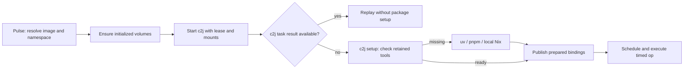

# Proposal: shared dependency caches for the Docker provider

Status: implemented in this checkout, including the default image switch to
`ghcr.io/colony-2/base:latest`. The refreshed image includes c2j 0.0.65 with addon
support; see prerequisites and test coverage below.

## Recommendation

Retain c2j's prepared tool environments in Docker named volumes. Keep dependency
resolution, installation, scope selection, and setup timing in c2j. Pulse owns
volume attachment, compatibility boundaries, initialization, and retention.
Each worker accesses the stores directly; no Nix daemon is required.

Use two volumes per namespace:

- A tool volume containing `C2J_TOOL_CACHE_DIR`, uv's download cache, and pnpm's
  package store. Compatible workers share it read/write.
- A Nix volume containing the complete `/nix` tree, including the store database,
  profiles, and roots. Compatible workers share it read/write and use
  `NIX_REMOTE=local`. Disable automatic GC and drain workers before maintenance.

Share within one JobDB deployment/tenant, resolved image, and platform. Enable
caching automatically for the supported Colony base image. Change
Pulse's default executor image to `ghcr.io/colony-2/base:latest` as part of the
rollout, including when persistent caching is disabled.

This gives repeated jobs reuse of installed uv/pnpm environments and Nix outputs,
as well as downloads. It needs no recipe scan, image build per package set, or
new provider-neutral preparation RPC.

## User experience: no cache setup

The normal `pulse run` flow requires no cache configuration. Users need their
existing Docker and JobDB setup; Pulse supplies everything else:

1. Resolve the executor image and derive the cache namespace automatically.
2. Create missing named volumes through the Docker Engine API. Docker manages
   their storage location, including inside Docker Desktop's VM.
3. Seed `/nix` from that image, establish permissions, and validate readiness in
   a short-lived initializer. No host Nix installation or manual directory setup
   is needed.
4. Attach the volumes and inject manager settings into each worker automatically.
5. Reuse them across jobs and controller restarts; initialize a separate pair
   when the image or another compatibility input changes.
6. Recover interrupted initialization and automatically retire expired, unused
   cache namespaces according to the retention rules below.

No user runs `docker volume create`, chooses volume names, sets cache environment
variables, copies the Nix store, or starts a service. The initializer and
maintenance operations are bounded Docker operations owned by Pulse. Configuration
is available only for overrides, including disabling shared caches.

## What the review established

The supplied [extension guide](EXTENSION_OPS.md) and
[addon proposal](PROPOSAL_EXECUTION_ENVIRONMENT_ADDONS.md) describe the intended
lifecycle. I also reviewed c2j commit
[`82362f0`](https://github.com/colony-2/c2j/tree/82362f0ec1ad68b79ed2fb078ca9418e722de0cd),
particularly its [execution-tools guide](https://github.com/colony-2/c2j/blob/82362f0ec1ad68b79ed2fb078ca9418e722de0cd/EXECUTION_TOOLS.md),
[cache design](https://github.com/colony-2/c2j/blob/82362f0ec1ad68b79ed2fb078ca9418e722de0cd/PULSE_ENVIRONMENT_PREPARATION_AND_CACHING.md),
and [tool manager](https://github.com/colony-2/c2j/blob/82362f0ec1ad68b79ed2fb078ca9418e722de0cd/pkg/toolenv/environment.go).

| Existing behavior | Consequence for Docker |
| --- | --- |
| Recipe/node `execution.packages` and extension `dependencies` accept `uv:`, `pnpm:`, and `nix:` references. | Pulse need not parse manifests or discover all dependencies. |
| c2j prepares tools only for live tasks; replay and unvisited scopes skip setup. | Mount storage at launch, but do not install packages at launch. |
| Setup precedes the timed op, has its own 30-minute limit, and obeys enclosing deadlines. | Preserve that boundary; do not move installation into an entrypoint wrapper. |
| `C2J_TOOL_CACHE_DIR` retains isolated uv installations, pnpm projects, Nix result links, and invocation bindings. | Persist this directory at one stable absolute path. Download caches alone are insufficient. |
| c2j uses per-entry file locks, installs at final paths, and atomically publishes `ready.json`. | Reuse its coordination; do not introduce a second package lock/index in Pulse. |
| A warm entry checks local readiness and avoids manager/version lookups. | A warm container can reuse installations without re-resolving mutable package references. |
| The package key includes cache version, OS, architecture, and reference, but not the base image or tenant. | Pulse must provide the outer compatibility and access namespace. |
| Scope bindings choose the nearest declaration; qualified runners dispatch prepared executables. | Pulse must not flatten dependencies into a global PATH or profile. |

For Nix extensions, [the implementation](https://github.com/colony-2/c2j/blob/82362f0ec1ad68b79ed2fb078ca9418e722de0cd/pkg/toolenv/nix_package.go)
separates manifest inspection from payload realization. Metadata records the
manifest, target system, and exact `/nix/store/...` output. Live setup realizes
that output and roots it under `C2J_TOOL_CACHE_DIR/nix-ops`; it does not follow a
moving selector again. Packaged manifests may add uv/pnpm dependencies, but reject
additional `nix:` dependencies. Nix runtime dependencies belong in the closure.
Both ordinary Nix tools and packaged ops use prebuilt outputs; missing substitutes
must fail setup rather than trigger a source build.

The [Docker adapter](internal/providers/docker/docker.go) resolves an
image to a local identity, creates a container, verifies its settings, and starts
the supplied process with the lease on stdin. It now provides tmpfs scratch and
the mounts described here. [The compute contract](pkg/compute/compute.go)
contains no package-preparation request. Keep that contract unchanged for this
first implementation.

The broader addon/cache documents discuss an external preparer and read-only
prepared environments. That is a later architecture. The current c2j manager
still creates locks and bindings during preparation, including warm preparation,
so its tool root cannot simply be mounted read-only. This proposal deliberately
uses shared writable tool environments and a shared writable Nix store within
a trusted tenant. A daemon would add lifecycle and resource accounting without
being necessary for this initial trusted-worker, offline-maintenance model.

## Default image and compatibility prerequisites

Adopt `ghcr.io/colony-2/base:latest` instead of `ghcr.io/colony-2/shai-mega:latest`.
Explicit recipe/job/configured images continue to take precedence.

The [base image source](https://github.com/colony-2/base/tree/81ebd7d22fae41cbda8ffbcf2caa7d8c9485df68)
provides Nix, c2j, uv/Python, pnpm/Node, Git, and Bash, with root as the runtime
user. Its executables and Python interpreter depend on its Nix profile and store.
The Nix configuration supplies signed public substituters and forbids local and
remote builds, including a pre-build hook for `preferLocalBuild` derivations.
Preserve that policy in each worker.

The refreshed image verified on Linux ARM64 reported:

```text
ghcr.io/colony-2/base@sha256:c5ac2acd9e1dda1f448c94997ec8a4f51cef9e87d59aaa77f9c750f7ee9993ea
c2j 0.0.65; Nix 2.35.2; uv 0.12.22; pnpm 12.9.0
Node v24.21.0; Python 3.14.7; UID/GID 0:0
```

The image's c2j binary and version manifest both identify 0.0.65, matching Pulse's
`v0.0.65` pin and including the reviewed addon support. Pulse also pins JobDB
`v0.0.28` in [go.mod](go.mod), and tests package-bearing demand decoding and
allocation projection. The previous image's old-worker prerequisite is resolved.

The tested image also lacks `sed` on PATH, which pnpm-generated launchers need,
and a conventional Linux dynamic loader needed by native Python wheels such as
Ruff. Tests use a declared Nix `gnused` dependency and pure-Python packages.
Caching does not supply missing runtime compatibility; these image requirements
must be addressed for affected tools.

Retain direct `c2j run with-lease` execution. Pulse overrides the entrypoint;
cache attachment does not require a service or an executor wrapper.

Keep Docker's current image refresh policy: inspect locally, pull if absent.
`latest` does not imply a registry lookup on every launch. An operator pull or
deployment refresh selects new content; new content gets a new cache namespace.
Use the resolved local image identity for compatibility, while retaining existing
`C2J_EXECUTION_IMAGE` and digest-attestation semantics.

## Cache layout and identity

Derive a namespace hash from a canonical encoding of:

```text
cache layout version
operator namespace and generation
JobDB instance ID and tenant ID
resolved Docker image identity and native platform
effective worker UID/GID
```

Use trusted launch metadata (`pulse_jobdb_instance_id`, `pulse_tenant_id`), not
recipe inputs. Disable attachment or reject invalid cache configuration if these
identities are missing; never put unidentified launches into a global cache.
Names are daemon-local, so identical names on another Docker daemon do not imply
shared storage. Docker provider aliases for the same socket must use identical
cache configuration, just as they currently require identical capacity settings.

Example volume names: `pulse-cache-v1-<hash>-tools` and
`pulse-cache-v1-<hash>-nix`. Label both with their role, full identity hash,
layout version, and operator owner hash. The identity hash includes the image
and generation. Validate labels before reuse;
a same-name volume with conflicting ownership is an error.

| Container-visible path | Contents | Worker access |
| --- | --- | --- |
| `/var/cache/pulse/tools` | c2j installations, bindings, readiness records, Nix result links | Read/write |
| `/var/cache/pulse/uv` | uv download/build cache | Read/write |
| `/var/cache/pulse/pnpm` | pnpm content-addressed package store | Read/write |
| `/nix` | Outputs, database, profiles, GC roots | Read/write |

The first three directories share the tool volume. Stable paths preserve Python
shebangs, interpreter references, pnpm launchers, and Nix root targets. Keep homes,
workspaces, JobDB leases, registry credentials, and ordinary temporary files out
of these volumes. Keep scratch at the existing tmpfs path.

Inject these settings for participating workers:

```text
C2J_TOOL_CACHE_DIR=/var/cache/pulse/tools
UV_CACHE_DIR=/var/cache/pulse/uv
pnpm_config_store_dir=/var/cache/pulse/pnpm
NIX_REMOTE=local
UV_PYTHON_DOWNLOADS=never
```

Also set Nix's `min-free = 0` to disable automatic garbage collection. Merge this
provider-owned setting with permitted Nix configuration while preserving the
image's substituters, signature checks, and no-build policy. Reject a conflicting
GC setting. Do not replace the image's entire configuration with a cache-only
configuration.

Leave `UV_TOOL_DIR` and `UV_TOOL_BIN_DIR` to c2j, which sets them per package.
Keep the image's Python/Node paths. Initially require the image-provided Python;
automatic interpreter downloads would require retaining their installation paths
as well. Avoid globally redirecting `HOME` or `XDG_CACHE_HOME`.

The pnpm variable above was tested against the reviewed image: `pnpm store path`
returned the requested directory plus `/v11`. `npm_config_store_dir` did **not**
redirect that image's pnpm. Include this probe in image compatibility checks.
pnpm retains its own store format suffix and import behavior; do not encode its
internal versioned layout in Pulse. See [pnpm store settings](https://pnpm.io/settings/store).
uv documents concurrent cache access and `UV_CACHE_DIR`; use its native cache
management rather than editing cache entries. See [uv caching](https://docs.astral.sh/uv/concepts/cache/).

Reserve these attachment settings when caching is enabled. Reject conflicting
`defaults.env` values rather than silently pointing a launch at another cache.
Package registry/substituter policy changes require a new operator generation;
image identity alone does not capture runtime configuration. Do not hash or log
credentials to create cache names.

## Nix initialization and concurrency

Mounting an empty directory over `/nix` would hide the image's own runtime.
Persisting only `/nix/store` would omit its validity database, profiles, and roots.
Initialize the **entire `/nix` tree from exactly the resolved worker image**.

1. Under the existing Docker admission ownership, create and validate both named
   volumes. A new namespace begins unready.
2. Create a bounded initializer from the resolved image, mounting the empty Nix
   volume at `/nix` with Docker's normal initial population enabled. Docker copies
   the image's existing tree into the empty volume. Mount the tool volume at its
   final path and create its directories for the supported UID/GID.
3. Verify the base profile, `c2j`, managers, store database permissions, and cache
   paths. Keep the successful **stopped** initializer as Docker's readiness
   record, named `pulse-cache-init-<hash>`. Inspect its exit status, image,
   ownership, mounts, and environment before reuse. No process remains running,
   and this record does not imply any recipe package has been prepared.
4. Attach workers with both volumes read/write and
   `NIX_REMOTE=local`. For later attachments use
   `VolumeOptions.NoCopy` so workers cannot populate an uninitialized volume.

Docker's volume population and persistence behavior is documented in
[Docker volumes](https://docs.docker.com/engine/storage/volumes/). Seeding is a
one-time disk copy of the base closure, not a package installation or OCI build.
Initialization failure must not leave a namespace eligible for use. Recreate
only known, unready, unreferenced volumes; never repair a live store by copying
another image over it.

Nix supports direct [local-store access](https://nix.dev/manual/nix/2.35/store/types/local-store).
Use Docker's local volume driver with working filesystem locks; do not assume
an NFS-backed volume is equivalent. Nix's store locks and database transactions
coordinate writes, while c2j's locks coordinate preparation of the same declared
package. Different versions retain separate directories. Keep the seeded base
profile unchanged; c2j uses per-package result links rather than installing tools
into a shared default profile. Pulse does not hold its batch submission mutex
for the duration of an op's setup.

**Concurrent writes and concurrent garbage collection are different concerns.**
Nix 2.35.2's [temporary-root implementation](https://github.com/NixOS/nix/blob/2.35.2/src/libstore/gc.cc)
assumes process IDs are unique and treats an existing same-PID temporary-root
file as stale. Separate container PID namespaces break that assumption. Therefore
this design does not rely on temporary roots to make live GC safe: disable
automatic GC with `min-free = 0`, prohibit worker-initiated GC/store deletion,
and perform maintenance only after every referencing container has stopped.
Do not work around this by exposing the host PID namespace.

Keep c2j's permanent result links and the seeded base profile rooted. A future
offline maintenance container must mount both volumes at their original paths
so indirect roots remain visible. V1 simply deletes an idle namespace as a unit.
See [Nix GC roots](https://nix.dev/manual/nix/2.33/package-management/garbage-collector-roots.html).

Mounts do not make this a hostile-workload boundary: workers can modify both
shared stores or override Nix policy. The default assumes jobs within a tenant
can trust each other's executable caches. Use
separate tenants/stores or disable caching for mutually untrusted workloads.
A later external preparer can publish immutable environments to read-only
workers, as the general addon proposal suggests.

## Launch flow and provider lifecycle



Attaching storage does not resolve any declared package.
A fully cached job still does no dependency setup, even if its container has
cache mounts. Mount all three managers' storage for participating images so
late-discovered extension dependencies work without provider intervention.

Cache preparation must complete before the worker starts. Pulse performs cold
namespace initialization automatically within submission and lease-start budgets;
manual pre-creation is never a prerequisite. Pulse still does not renew the
job's supplied lease. Never spend the worker's 30-minute setup allowance on a
provider operation before c2j has started renewing ownership.

There is no persistent helper process to charge or shut down. Keep the stopped
initializer record and idle volumes, and reconstruct their worker references
from Docker after Pulse restarts. Warm attachment needs only Docker inspection.
Controller shutdown does not affect store access by continuing workers. Package
manager CPU/memory consumption stays within each worker's existing limits.

The short-lived initializer still needs explicit bounds and recovery. Serialize
initialization and charge it against the pending worker's reserved capacity,
waiting for it to exit before worker start so those processes do not overlap. Label its role
and intended launch/namespace; reconcile uncertain initializer creation before
spending that reservation again. Existing `usage()` treats every
`pulse_managed_by=pulse` container as a job, so update inspection to recognize and
validate initializers without listing them as jobs or double-charging their
reservation. No background service budget or automatic pool expansion is needed.

Volume creation or initialization failure before worker creation can
return `unavailable` and allow normal fallback. A conflicting cache identity is
a configuration error. Preserve `unknown` for uncertain worker create/start
outcomes; a cache failure does not establish that a worker never started.
On retry, recover an existing launch's recorded attachment plan. Label its cache
identity and include the effective mounts/settings in conflict verification;
do not reattach the same launch ID to a newer generation.

Verify actual Docker mount sources, destinations, read-only flags, and injected
settings before start, alongside existing limit/tmpfs verification. Keep direct
c2j execution, finite lease stdin, cancellation, and worker auto-removal intact.
Named cache volumes outlive automatically removed workers.

## Configuration

No YAML is required for caching with the default Docker provider and base image.
The following illustrates the defaults and optional overrides:

```yaml
defaults:
  image: ghcr.io/colony-2/base:latest   # Default; may be omitted.

providers:
  docker:
    type: docker
    capacity:
      cpu: "4"
      memory: 8Gi
      max_containers: 2
    dependency_cache:
      enabled: true
      namespace: default
      generation: "1"
      max_age: 720h
```

`enabled` defaults to true for supported images. Set it to false to run with
container-local stores. Tenant partitioning is mandatory in v1, with no global
cross-tenant sharing switch. `namespace` defaults to `default` and distinguishes
independent operator deployments on one daemon; `generation` requests a fresh set of stores without
changing package declarations and defaults to `1`. Neither requires user input.
`max_age` defaults to 720 hours (30 days), and accepts positive Go durations up
to 8760 hours. There is no Nix service configuration.

Limit v1 attachment to the supported Colony base image family, including its
pinned digests, after compatibility validation. Custom images continue to run
without these mounts. Supporting another image requires an explicit image
contract for runtime paths, user, manager versions, and Nix store composition;
do not mount a Colony store over an arbitrary image's `/nix`.

## Refresh, loss, retention, and observability

A prepared unpinned uv/pnpm/Nix reference remains at its installed selection while
its c2j entry survives. Changing generation or evicting an entry permits a fresh
resolution. Nix metadata for newly resolved extension selectors follows the
worker's configured Nix TTL; recorded extension outputs retain their exact
identity. Provider generation changes do not rewrite durable job history.
Ordinary unpinned tool declarations do not gain a new transitive lock guarantee.

Use whole-namespace retention in v1. Do not run automatic package pruning or Nix
GC while workers use that namespace. A lock held only during installation does
not protect a running executable from eviction. Pulse automatically checks for
expired namespaces at provider startup and at most hourly during normal polling.
`max_age` is measured from successful namespace initialization, recorded in its
stopped initializer's `FinishedAt`; it is an age limit, not a claim of least-recently-used tracking. A
namespace older than this limit is eligible for deletion only when idle. Active
namespaces remain available until a later check finds them idle; workers are
never interrupted for cache cleanup.

For automatic retirement or an explicit reset:

1. Under the same admission ownership used for launches, block new attachments
   briefly and inspect all containers referencing either volume, including
   created or uncertain workers and initialization/maintenance helpers.
2. If any reference is live or its state is uncertain, skip retirement and retry
   on a later pass. Do not wait for a job to finish while holding the launch gate.
3. Retire both volumes as a pair, checking ownership labels. The next launch
   seeds a fresh namespace. Never force removal of an in-use volume.

Deleting a pair is not an atomic Docker operation. Remove the stopped initializer
first to invalidate readiness, then the Nix volume, then the tool volume. Reconcile a
partially removed pair before allowing another
attachment. A missing member makes the pair unready; validate ownership and
references before completing deletion and reseeding. Reconcile interrupted
initializers similarly, without asking users to remove leftover volumes.
Maintenance operates only on recognized Pulse cache resources. It never invokes
global `docker volume prune` or removes unrelated volumes.

Recover references from Docker after a controller restart; no Pulse database is
needed. Read readiness and age from the stopped initializer and volume creation
timestamps through bounded Docker operations. If metadata or
container inspection is unavailable, defer deletion. Retained volumes consume
Docker disk, not advertised job scratch. Automatic age-based retirement handles
routine cleanup, but ordinary Docker volumes provide no hard size quota and
active caches can grow. Disk exhaustion remains an explicit infrastructure error;
do not promise unlimited growth or a disk reservation from a free-space check.
Cleanup runs while Pulse is running with caching enabled; retained caches in the
configured operator namespace are reconciled when it next starts, without an
additional background service. Changing the operator namespace or disabling
caching leaves old namespaces intact.

If storage is missing before launch, recreate the namespace. If a live prepared
environment loses readiness, c2j returns to setup before the dependent op; cached
task results continue to replay. A corrupt store is an explicit setup/provider
failure, not permission to select another version of a recorded Nix output.
Do not silently recreate or substitute a store beneath running workers.

Record namespace/generation, resolved image, cold initialization time, and
attachment outcome in provider diagnostics. Keep package identity,
`prepared`/`reused`/`failed`, `setup.wall_ms`, and `setup.task_ordinal` in c2j's
existing diagnostics. Count a shared setup ordinal once. An attached volume is
not itself a tool-cache hit. Avoid credentials and raw registry configuration
in labels/logs.

## Alternatives considered

| Option | Assessment |
| --- | --- |
| Mount only uv/pnpm download caches | Simple but repeats installation and environment assembly; misses c2j's existing prepared-cache support. |
| Shared writable `/nix` volume | Recommended for trusted workers. Retain the complete store state, use local-store access, and allow maintenance only after workers drain. |
| Nix daemon with read-only worker mounts | Optional later design if centralized store policy or live maintenance becomes necessary. Adds a persistent service, socket, recovery, and resource accounting; not needed for v1. |
| Separate per-job Nix stores plus a shared binary cache | Preserves independent base stores, but transfers/unpacks outputs repeatedly and does not directly retain uv/pnpm environments. Useful for stricter isolation later. |
| External preparer and read-only tool mounts | Matches the general proposal's longer-term boundary, but requires a new demand/activation interface and changes to c2j's writable preparation path. |
| Build an OCI image for each tool set | Adds build/publish lifecycle and package-set invalidation; awkward for lazily discovered dependencies. Reconsider for providers without persistent local storage. |

## Implementation and acceptance plan

1. **Align versions and switch the default.** Publish an addon-capable base;
   update Pulse's c2j/JobDB pins and validate package-bearing discovery. Replace
   the old default in `internal/config/config.go`, configuration/CLI tests,
   `docker_c2j_integration_test.go`, CI's image pre-pull, README, configuration
   docs, Docker example, and contributing/design documentation. The new image
   has no `curl` on PATH; update the integration fixture's HTTP calls to use
   bundled Python, or explicitly supply a declared tool in tests that exercise
   addon preparation. Do not assume the old mega image's implicit tool set.
2. **Implement storage lifecycle.** Add typed cache configuration,
   alias validation, namespace derivation, Docker volume APIs, initialization,
   initializer recovery/accounting, native mounts, environment conflict checks, and
   inspect-before-start verification. Include default-on attachment and automatic
   recovery/retirement so normal operation requires no cache setup. Keep package
   logic out of Pulse.
3. **Exercise the actual c2j lifecycle.** Submit through the updated c2j API, or
   set `tool_setup_version: 1` when constructing `StartJob` directly. Test two uv,
   two pnpm, and two Nix tools plus a prebuilt Nix extension with extra dependencies.
4. **Validate the automatic default before release.** Compare cold setup, a second
   container, a controller restart, and a one-tool change. Report setup separately
   from container startup and volume initialization. Ship automatic caching once
   the concurrency, retention, and platform checks pass; retain an explicit opt-out.

Required checks include:

- Start `pulse run` with no cache configuration and no existing cache volumes.
  Verify automatic creation, seeding, permissions, settings, mounts, and reuse
  by a second worker. Repeat after controller restart and with the opt-out.
- Interrupt initialization and retirement between each Docker mutation. Verify
  automatic reconciliation, no attachment of partial pairs, and no deletion of
  active, uncertain, or unrelated resources. Check age-based retirement and
  next-use recreation without manual cleanup.
- Warm jobs reuse installed tools; block package-network access after initial
  preparation to distinguish reuse from a fast download. Permit unrelated
  JobDB/source traffic needed by the test.
- Two containers concurrently prepare the same and different packages without
  partial readiness; verify plain-name precedence and qualified versions.
- Replay and unvisited branches perform no new manager calls or setup, even
  after cache loss. A new live task re-enters setup outside its op timeout.
- Packaged Nix ops inspect metadata before payload download, realize only the
  recorded output, validate its manifest, and fail before execution when the
  output is absent from configured binary caches.
- Canceled initialization, interrupted installers, uncertain
  Docker responses, and controller restart preserve admission and recovery rules.
- New image content, tenant, platform, and generation select separate stores.
  Seeded Nix/Python/Node/c2j paths continue to work; base roots and tool roots
  remain visible to offline maintenance.
- Exercise concurrent Nix processes with overlapping container PIDs, same-output
  and different-output imports, and downloads from a binary cache. Verify that
  automatic GC is disabled and maintenance refuses active namespaces.
- Resource accounting includes initialization; cache storage never replaces scratch.
  Pruning refuses live/uncertain references. Credentials are not persisted in
  shared homes or cache metadata.
- Run on native Linux AMD64 and ARM64 and Docker Desktop. Validate manager
  configuration and non-root image behavior before expanding supported images.

### Experiments completed for this proposal

On the available Linux ARM64 Docker daemon, I pulled and inspected the image
listed above and verified its manager versions and pnpm environment setting.
A disposable experiment seeded a named `/nix` volume, then ran four concurrent
containers with both volumes read/write, `NIX_REMOTE=local`, and `min-free = 0`.
Each imported the same file plus a distinct file into the store, created a
separate `nix build --out-link` root for the existing base profile, and executed
Python through that link. A fresh container found all four permanent roots;
`nix-store --verify --check-contents` passed after the writers exited.

An earlier experiment also verified the daemon alternative with two clients,
but the direct-store experiment supports the simpler recommendation here.
All experiment containers and volumes were removed; the pulled image remains.

Implementation testing also passed on native Linux ARM64 with two concurrent
cold workers and two concurrent, network-disconnected warm workers after provider
restart. The pinned c2j tool manager prepared six scoped dependencies (two uv,
two pnpm, and two Nix references), dispatched nearest and qualified versions,
and retained a locally registered Nix extension output. Warm setup reported all
six tools reused and `wall_ms: 0`; the extension output was also reused. Generation
reset produced an empty cache, and automatic retirement removed both idle pairs.
Unit tests cover initialization failures, mount verification, identity isolation,
opt-out, interrupted initialization/removal, ownership checks, cancellation,
and uncertain-create reservations.

The integration test uses a test-only program linked to the pinned c2j tool
manager in a derived base image. It does not validate the installed c2j binary's
addon support, full extension compilation/replay, or AMD64/Docker Desktop behavior.
The existing supplied-lease end-to-end test remains separate. Live GC is explicitly
outside the supported lifecycle. Native limit enforcement could not run in this
nested Docker environment; tests exercised the existing unenforced fallback while
still checking admission budgets.

Validation after updating to c2j v0.0.65:

- `go test -race -count=1 -timeout=45m ./...` passed the full suite, including
  supplied-lease execution, heartbeat renewal and transport failure, peer and
  host-gateway connectivity, localhost translation, dependency caches, and unit
  tests. The JobDB/Git fixture now runs in a separate Docker container with
  distinct published and peer URLs, supporting native and containerized runners.
- `make vet build`, `node --test scripts/npm.test.js` (four tests), and
  `git diff --check` passed.
- The refreshed base image's version manifest records `C2J_VERSION: 0.0.65`,
  matching its installed binary and Pulse's pinned module. Existing Docker hosts
  should pull the updated image; Pulse pulls only when the requested image is
  absent locally. New image content automatically selects a separate cache pair.
- Endpoint-selection and localhost-forwarding tests also cover the peer-runner
  fallback when the Docker host's published port is not on the runner's loopback.
  Initial lease failure assertions use c2j 0.0.65's diagnostic and verify that no
  execution chapters were persisted.

All cache-test containers, volumes, and derived images were cleaned up. The base
image remains cached locally. Cross-platform CI remains a release check.
