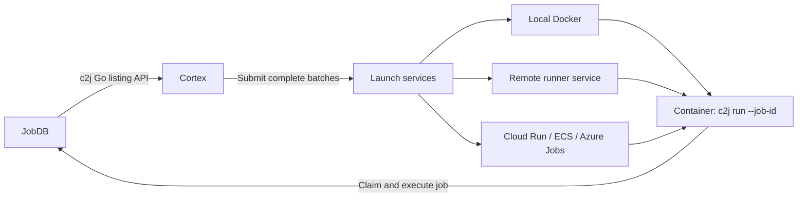

# Cortex

**Container compute for c2j jobs, across cloud services and your own runners.**

Cortex watches explicitly configured repository cells for jobs that need an executor. It selects a launch service, supplies the job's execution requirements, and starts a container running `c2j` for that job. Every launch carries metadata linking it back to its JobDB instance, tenant, and job.

[Quick start](#quick-start) · [Container image](#container-image) · [Providers](#providers) · [Configuration](#configuration) · [Releases](docs/releases.md)

## How it works



- **Small controller:** no database, notifications, or runner registry. Polling, per-job cooldowns, and round-robin cursors stay in memory.
- **Portable requirements:** image, architecture, CPU, memory, and scratch capacity come from c2j, with configured defaults when absent. Executor environments report the requested/defaulted resources; providers guarantee at least those capacities without changing supplied values.
- **Batch placement:** services accept or decline individual jobs in a batch. Cortex tries equal-priority peers before moving to a lower-priority tier.
- **Clear ownership:** c2j manages job leases, replay, and changes in execution requirements. Cortex lists through c2j’s public Go API and supplies compute; executor containers run the c2j command.

## Install

### npm

```sh
npm install --global @colony2/cortex
cortex -version
```

The release workflow publishes `@colony2/cortex`. Its installer downloads the matching native executable from GitHub Releases and verifies its SHA-256 checksum. Node.js 22 or newer, `tar`, and HTTPS access to GitHub release assets are required. Install scripts must be enabled. Job listing is embedded in Cortex through `github.com/colony-2/c2j/pkg/joblist`; the controller needs no separate c2j executable. Executor job images still need c2j.

| Platform | AMD64 / x86-64 | ARM64 / Apple Silicon |
| --- | --- | --- |
| Linux | ✓ | ✓ |
| macOS | ✓ | ✓ |
| Container image (Linux) | ✓ | ✓ |

This matches c2j's release matrix. Windows packages are not currently supplied. The local Docker provider requires a Linux controller; the remote and cloud adapters are also available on macOS.

### Native executables

Download the archive for your platform from [GitHub Releases](https://github.com/colony-2/cortex/releases), verify it against `checksums.txt`, and put `cortex` on your `PATH`. Linux archives also include the static `cortex-exec` helper used by the Docker and ECS providers. A standalone Cortex executable does not require Node.js.

## Quick start

1. Install Cortex and select an executor image containing a compatible c2j release with execution support.
2. Copy [examples/remote.yaml](examples/remote.yaml) to `cortex.yaml`. Set your JobDB tenant URL, repository cells, runner-service endpoint, and default executor image.
3. Supply the provider token and start Cortex:

```sh
export CORTEX_PROVIDER_TOKEN='your-provider-token'
cortex -config cortex.yaml -check
cortex -config cortex.yaml -once
cortex -config cortex.yaml
```

`-check` validates configuration, initializes the listing backend, and initializes providers. Embedded listing makes no network request during this check; connection/authentication failures appear during polling. `-once` performs one polling pass. The normal mode keeps polling until SIGINT or SIGTERM. Logs are JSON on stderr; containers already launched continue under their own lifetime controls.

For a local machine, start with [examples/docker.yaml](examples/docker.yaml). For cloud services, use [examples/clouds.yaml](examples/clouds.yaml).

## Container image

Releases publish **`ghcr.io/colony-2/cortex`** for `linux/amd64` and `linux/arm64`. Docker chooses the matching architecture automatically.

The image uses **distroless static Debian**, runs as UID/GID `65532:65532`, and contains:

- `/usr/local/bin/cortex`
- `/usr/local/bin/cortex-exec`
- CA certificates and bundled version/license records under `/usr/share/cortex`

Copy [examples/container.yaml](examples/container.yaml) to `cortex.yaml`, fill in the deployment values, and run:

```sh
docker run --rm --init \
  --read-only --tmpfs /tmp \
  --mount "type=bind,source=$PWD/cortex.yaml,target=/etc/cortex/cortex.yaml,readonly" \
  -e CORTEX_PROVIDER_TOKEN \
  ghcr.io/colony-2/cortex:latest
```

The mounted configuration must be readable by UID 65532. For repeatable deployments, select a release tag such as `:vX.Y.Z` or a manifest digest. `latest` advances after a successful release; both architectures embed the c2j module version pinned in `go.mod`, recorded in `/usr/share/cortex/c2j-version.txt` and the GitHub release's `versions.txt`. The default image contains no c2j executable, Node.js, npm, shell, or Git.

Inspect the executables without a shell:

```sh
docker run --rm ghcr.io/colony-2/cortex:latest -version
```

**Cloud providers work in the standard image.** Cortex embeds native Go SDK authentication and ECS calls. In cloud environments, attach a service account, task/instance role, or managed/workload identity to the controller. Elsewhere, supply credentials through environment variables or mounted files. The SDKs refresh credentials from supported sources automatically; no cloud CLI is required. See [cloud authentication and container examples](docs/cloud-authentication.md).

Local Docker additionally needs socket permissions, a shared host lock directory, and a supervisor path visible at the same absolute location to the controller and daemon. See [provider operations](docs/providers.md).

This is a controller image. Configure `defaults.image` for your workload's executor image, including c2j and any shell, Git, or language tools required by its recipes. The controller image itself contains no shell or Git; use explicit repository selectors in its configuration.

### Build an image locally

The default image uses the pinned listing library and builds without downloading a c2j executable:

```sh
docker buildx build --load \
  --build-arg VERSION=dev \
  -t cortex:local .
```

For a multi-architecture registry build, replace `--load` with `--platform linux/amd64,linux/arm64 --push` and use your registry tag. GitHub Releases also include per-architecture container archives that can be imported with `docker load --input <archive.tar.gz>`.

## Providers

| Provider | Configuration type | Capacity and placement |
| --- | --- | --- |
| Local Docker | `docker` | Explicit CPU, memory, and container-count budget; reconstructs commitments from container metadata. No disk quotas. |
| Remote service | `remote` | Authenticated [OpenAPI protocol](api/provider.openapi.yaml), batch submission, partial acceptance, and capacity fallback. |
| Google Cloud Run Jobs | `cloudrun` | Rounds up to supported job resource sizes; native execution timeout. |
| AWS ECS Fargate | `ecs` | Standalone tasks with supported task sizes and the execution supervisor. |
| Azure Container Apps Jobs | `azurejobs` | Manual jobs with supported CPU/memory pairs and native execution timeout. |

A future service that registers external runners and dispatches work by long polling can implement the remote protocol. Cortex sends complete batches through its submit API; launch inspection is available for diagnostics.

See [provider configuration and limitations](docs/providers.md) for authentication, image storage bounds, Docker admission, retention, and cloud allocation details.

## Configuration

Each target selects a JobDB instance/tenant and a list of repository cells. Launch services have positive numeric priorities: **1 is preferred over 2**. Services at the same priority rotate first choice per batch.

```yaml
targets:
  - instance_id: production
    jobdb: https://jobdb.example.com/acme
    cells: [github.com/acme/api, github.com/acme/worker]
    launch_services:
      - {name: runner_pool_a, priority: 1}
      - {name: runner_pool_b, priority: 1}
      - {name: cloud_overflow, priority: 2}
```

Define those service names under `providers` in the same file. Full examples include [remote](examples/remote.yaml), [Docker](examples/docker.yaml), [cloud](examples/clouds.yaml), and [container](examples/container.yaml) configurations.

Defaults include a 5-second poll interval, a 60-second per-job cooldown, and batches of at most 100 jobs. A confirmed `no_capacity`, `unsupported`, or `unavailable` response permits fallback. An uncertain submission retains its cooldown without immediate fallback, since compute may already have started.

Only recipe job routes are selected by default. With the default `c2j.mode: embedded`, cells must be explicit repository identities, such as `github.com/acme/app` or `file:///absolute/repository/path`. They must match the metadata used at submission. Local filesystem paths, configured aliases, and current-directory discovery require external mode. The library performs no checkout or local configuration discovery.

For authenticated JobDB access in embedded mode, set `jobdb_token_env: JOBDB_TOKEN` on the target and supply that environment variable. Cortex sends it as a bearer token to that target and does not follow HTTP redirects. Provider authentication remains configured separately.

### Optional external c2j listing

Use [examples/external-c2j.yaml](examples/external-c2j.yaml) when you need an independently installed CLI or its local cell resolution:

```yaml
c2j:
  mode: external
  executable: /usr/local/bin/c2j
  # expected_version: c2j version 0.0.52
  # working_dir: /srv/cortex
```

`executable`, `expected_version`, `working_dir`, and `env` are external-mode settings. Existing configurations using those fields must add `mode: external`, or remove them to use embedded listing. External mode checks the executable before starting; there is no automatic fallback between backends. `expected_version` matches the complete output of `c2j version`.

To include an external binary in a deployment image, build the optional target:

```sh
C2J_VERSION=$(python3 scripts/fetch_c2j.py)
docker buildx build --load --target external-c2j \
  --build-arg "C2J_VERSION=$C2J_VERSION" -t cortex:external .
```

Configure `mode: external` to use it. The default published image uses embedded listing. Both modes leave executor job commands and resource handoff semantics unchanged.

A controller restart loses its cooldown and may cause duplicate compute. JobDB leases protect job ownership; job side effects still need their normal idempotency. Provider resources are retained for inspection; configure terminal-resource cleanup for your deployment.

## Development

Go 1.26 or newer is required. Packaging tests also use Node.js 22+, Python 3, and standard Unix archive tools.

```sh
make build          # bin/cortex and bin/cortex-exec
make test           # Go tests with the race detector
make vet
make test-packaging # npm installer and c2j download verification
```

The public listing API is currently pinned to `v0.0.53-0.20260922032206-ef65f0001972`, a published Go pseudo-version for the upstream commit containing it; no tagged release contained the API when integrated. There is no local module replacement.

The suite covers scheduler concurrency/fallback, CLI-to-remote integration, Docker accounting/recovery, cloud request mappings, and package installation. CI runs on Linux AMD64, Linux ARM64, and macOS, cross-compiles all four release executables, and smoke-tests both container architectures.

The embedded adapter is tested against the real JobDB HTTP protocol, including cancellation, tenant isolation, pagination, and demand projection. CLI-to-provider integration runs with an empty `PATH` in embedded mode. The optional external adapter’s JSON contract has also been checked against c2j v0.0.52 and a temporary JobDB server. To repeat that read-only integration check against your own seeded test tenant:

```sh
CORTEX_TEST_C2J=/path/to/c2j \
CORTEX_TEST_JOBDB=http://127.0.0.1:8080/test-tenant \
CORTEX_TEST_CELL=/path/to/test-cell \
go test -race ./internal/c2j -run TestLiveC2JExecutable -v
```

Cloud adapter tests use HTTP/CLI doubles. Real cloud IAM, networking, and workload execution require deployment acceptance checks.

## Design and release documentation

- [Architecture and scheduling](DESIGN.md)
- [Provider operations](docs/providers.md)
- [Implementing a remote provider](docs/implementing-a-remote-provider.md)
- [Remote protocol](REMOTE_PROVIDER_PROTOCOL.md) and [OpenAPI schema](api/provider.openapi.yaml)
- [Docker capacity design](LOCAL_DOCKER_PROVIDER.md)
- [Release process and publishing setup](docs/releases.md)
- [c2j execution tracking guide](GUIDE-Execution-Tracking.md)

## License

[Apache-2.0](LICENSE). The npm packaging follows [c2j's release implementation](https://github.com/colony-2/c2j/tree/main/npm/c2j), with Cortex-specific installation and process-control tests.
