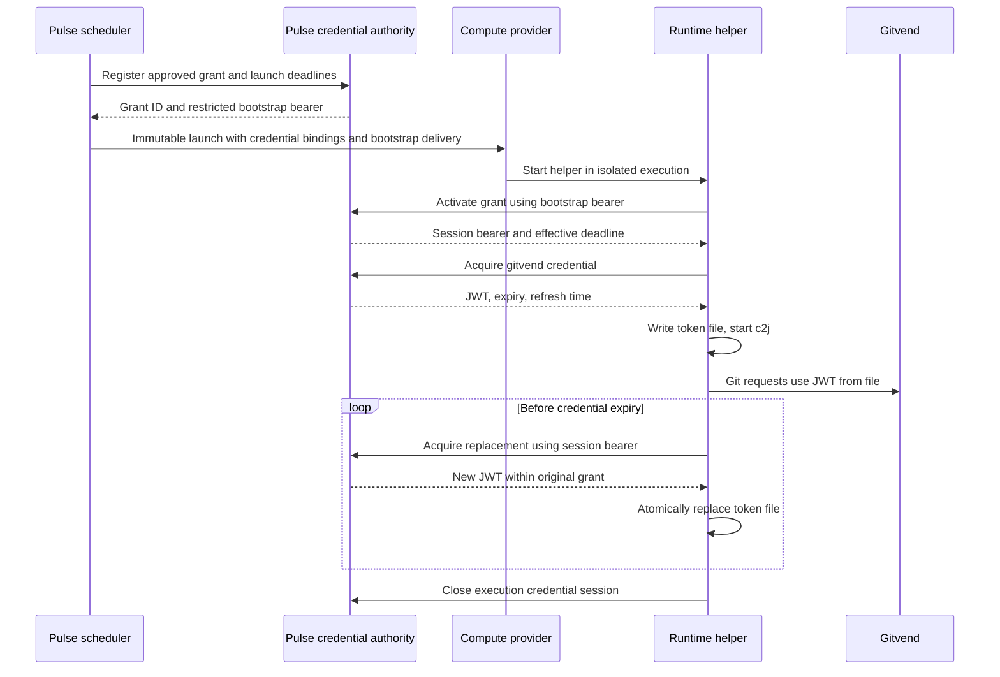

# Pulse-owned job credentials

Status: proposal for review; no implementation changes. Written 2026-09-30 against Pulse `fea09cb`.

Companion: [Vault and workload identity integration](vault-and-workload-identity-design.md).

## Recommendation

Pulse can own job credential issuance, delivery, and renewal while holding the private signing keys itself. Add a credential authority inside Pulse and a runtime helper that obtains short-lived credentials from that authority. For gitvend, the helper maintains a token file that Git reads through the gitvend credential helper.

The scheduler establishes the approved grant once per launch. The credential authority checks that grant on every issuance. The runtime requests replacement credentials; Pulse does not need inbound access to containers or provider-specific mechanisms to push every rotation.

This is option 2: Pulse is the issuer and ongoing credential authority. An internal issuer interface leaves room to move signing or secret resolution to Vault later, without requiring an external broker initially.

“Private JWTs” means private JWT **signing keys** here. JWTs are the short-lived outputs. Possessing an existing JWT does not let Pulse extend its expiry or mint replacements.

## Existing behavior and changes in scope

Pulse currently builds a literal environment map in [the controller](../internal/controller/controller.go), passes a complete immutable [launch](../pkg/compute/compute.go) through provider fallback, and lets c2j acquire job ownership. Scheduler cooldowns are in memory. The current [supervisor](../internal/supervisor/supervisor.go) enforces process lifetime but has no credential logic. Cloud Run and Azure launch the supplied command directly; Docker and ECS use `pulse-exec` for supervision.

The [HTTP API](http-api.md) is public, unauthenticated, and read-only. Credential issuance needs a separate authenticated API and must not inherit that API's access or CORS policy. Current configuration redaction recognizes environment maps; it is not a sufficient secret-handling contract for new fields.

This proposal adds persistent authorization state and an ongoing service dependency. Compute can still outlive the scheduling loop, but credential-dependent work can continue only while it has valid credentials or can reach a live issuer.

## Ownership and trust

| Component | Owns |
| --- | --- |
| Deployment administrator | Signing keys, issuer ceilings, allowed credential profiles, trusted providers, and maximum lifetimes. |
| Pulse scheduler/controller | Authorizing a profile for a tenant/job/launch and arranging its runtime bindings. |
| Pulse credential authority | Grant/session state, credential issuance, policy checks, renewal denial, key selection, and audit events. |
| Runtime helper | Initial acquisition, local secret files, refresh scheduling, readiness, and cleanup. |
| Compute provider | Isolation, protected bootstrap delivery, helper execution, and compute lifetime enforcement. |
| c2j/JobDB | Job ownership, leases, execution, and handoff. |
| Gitvend | Checking the issued grant and enforcing Git access with its upstream GitHub credentials. |

Job or recipe metadata can request a named access profile. Trusted deployment policy decides whether that profile applies. A job must not choose an arbitrary signing key, credential source, issuer URL, file destination, or permission string and thereby authorize itself.

Credentials delivered to a job are accessible to that job. This design limits authority and duration; it does not conceal a usable bearer token from malicious code that is authorized to read it. Providers and their administrators are also in the trust boundary unless a stronger attestation/encryption design is added.

## Separate identity, grants, and bindings

Use three concepts rather than treating every secret as another environment entry:

| Concept | Example | Meaning |
| --- | --- | --- |
| Execution identity | `(jobdb instance, tenant, job ID, launch ID)` | Which logical job and particular execution attempt is being authorized. |
| Credential grant | `repository-worker` for one repository and job branch prefix | What credentials the execution may obtain, with a maximum lifetime. |
| Runtime binding | File `/run/pulse/secrets/gitvend.jwt` | How the application receives a value. |

Keep a job's branch namespace stable across retries when desired, while assigning a new credential grant/session to each launch. A `job ID` or `launch ID` supplied in an HTTP request is a lookup key, never authentication by itself.

A proposed grant record contains:

```text
grant_id
instance_id, tenant_id, job_id, launch_id
profile_id, policy_revision, canonical_approved_permissions
allowed_credential_bindings
created_at, activate_before, absolute_not_after
execution_timeout
status: pending | active | closed | revoked | expired
bootstrap_hash, activation_request_hash, session_hash
activated_at, session_not_after
```

Store source references and approved permissions, not private keys or emitted JWT values. Store high-entropy bootstrap/session bearers as hashes. Authentication still requires possession of the original bearer. Encrypt any exceptional retained secret values with a separately managed key.

## Credential sources and delivery

Start with three source types behind an internal issuer interface:

1. `gitvend`: sign a new JWT for a stored grant.
2. `controller_env`: read an explicitly allowlisted controller variable at acquisition time.
3. `controller_file`: read an explicitly configured secret file at acquisition time.

Do not copy the controller environment wholesale. Environment-backed source values change only when the controller process receives a new environment, normally through restart. File-backed values can be reread under a defined reload policy. Returning a static upstream secret does not make that secret job-scoped or revocable.

Bindings should distinguish:

- **Environment:** obtain a value before `exec`; fixed for that child process's lifetime.
- **File:** create a private file and replace it atomically when refreshed; applications must reopen or otherwise reload it.
- **Local credential endpoint:** a future option for clients that can ask for credentials on demand.

Use files for gitvend. An environment variable can point to the file, but should not contain the rotating JWT. The helper must create the private directory, validate ownership and paths, reject symlink traversal, and replace files within the same filesystem. A file mode of `0600` is suitable when the writer and consumer share a UID; distinct helper/application users require an explicit read-access arrangement. Prefer per-execution ephemeral storage and exclude it from artifacts and snapshots.

## Launch and activation sequence



Register the grant after scheduler eligibility/reservation and before submitting compute. This avoids creating live grants for every discovery result. Persist it before exposing its bootstrap bearer to a provider. If grant persistence fails, do not launch a credential-dependent job.

Mint the actual gitvend JWT at runtime activation/acquisition, so queue time does not consume its lifetime. Require a finite activation window for credential-enabled jobs, even though today's `start_before` is optional. A reasonable initial default to evaluate is five minutes, with operator-configured longer windows for queued providers.

Suggested deadline calculation:

```text
absolute_not_after = min(activate_before + execution_timeout,
                         any stricter deployment deadline)
session_not_after = min(activated_at + execution_timeout,
                        absolute_not_after)
credential_expiry = min(now + issuer_token_ttl, session_not_after)
```

Activation is the start of the credential clock, not a claim that c2j already owns the job. Initialize that clock before credential-dependent bootstrap. Delays can shorten useful execution; they must not extend authorization.

## Bootstrap and authenticated renewal API

Use a dedicated HTTPS endpoint, for example `https://pulse-credentials.example.com`. It can be served by the same process initially, but uses separate routing, authentication, limits, and operational policy from diagnostics. Do not redirect credential-bearing requests. Responses use `Cache-Control: no-store`; logs omit request bodies, authorization headers, and secret values.

Proposed protocol, not an existing API:

| Operation | Authentication | Behavior |
| --- | --- | --- |
| `POST /v1/credential-sessions/activate` | Bootstrap bearer | Activate exactly one grant/session before its activation deadline. |
| `POST /v1/credential-sessions/{id}/credentials/{binding}` | Session bearer | Return a fresh value plus `expires_at` and `refresh_after`; no caller-supplied permissions. |
| `POST /v1/credential-sessions/{id}/close` | Session bearer | Idempotently stop future issuance for this session. |
| Administrative revocation | Separate operator/service identity | Revoke a grant; never authorized by an ordinary workload token. |

The bootstrap is a short-window, high-entropy bearer restricted to one grant. The session bearer remains a sensitive credential for the entire authorized session, even though individual gitvend JWTs are shorter-lived. Stealing it permits repeated issuance within that grant until revocation or the session deadline. Short JWT TTL alone does not reduce that longer exposure.

Make activation retry-safe: the helper generates a random activation nonce and a random proposed session bearer, submits both over TLS, and retains them until activation is acknowledged. Atomically store their hashes with the grant. An exact retry with the same bootstrap and activation data succeeds; a competing activation fails. No raw response bearer needs to be stored for replay. The bootstrap permits only activation/recovery of that same session, not arbitrary credential requests. Expire the recovery window promptly after activation.

A consumed bootstrap is not remote attestation: whoever steals it and activates first can win. Use a protected provider secret/file channel where possible. A prototype may deliver it in the helper's launch environment, but then native container/task inspection can expose it. The helper removes it from the child environment, which reduces inheritance but does not erase it from provider configuration. Treat that as an explicit deployment limitation.

Each credential request checks session authentication, status, deadline, binding allowlist, and current policy. Policy removal stops issuance. Initially, reject renewal if the relevant policy revision changes and require a new grant; avoid implementing unsafe ad hoc intersections between wildcard permission expressions. Never silently broaden an existing grant.

## Gitvend issuer details

Gitvend currently uses Ed25519 signatures with `alg=EdDSA` and `typ=gitvend+jwt`. Its verifier expects its specific claims and grant version, rejects unknown fields, and supports a token-file credential helper. The default maximum token lifetime is 900 seconds. It verifies requests without contacting the issuer. These are existing gitvend behaviors, not proposed Pulse features. [Gitvend README at reviewed commit](https://github.com/colony-2/gitvend/blob/9f3d2173731a511edeb0c80a51f01f83df2d62f1/README.md#issue-an-agent-credential)

Use an opaque launch-specific subject that Pulse can map back to the full execution identity, and a fresh `jti` per issued JWT. Keep arbitrary Pulse metadata in Pulse's audit/grant records; do not append unsupported claims to gitvend tokens. Configure the exact issuer, audience, and key ID accepted by the gateway.

Example approved permissions:

```text
github.com/acme/api#main:r
github.com/acme/api#jobs/j_123/*:rw
```

Generate branch components from a validated identifier encoding. Untrusted job strings must not introduce grant wildcards or delimiters. Add source, recipe, submodule, or dependency repository access only through explicit policy; the primary cell alone may not cover all bootstrap reads.

An initial TTL of ten minutes and refresh around two-thirds of that interval gives room for retries beneath gitvend's default ceiling. Add jitter, use returned server times, and cap each issuance by the grant deadline. Refresh means signing a replacement JWT, not extending the existing JWT.

Pin a gitvend version and reuse its signing implementation if exposed through a supported package. At the reviewed commit the auth implementation lives under `internal/`, so do not assume Pulse can import it directly. Options are extracting a public signing package in gitvend or bundling and invoking the pinned `gitvend sign` executable. The latter changes Pulse's current minimal controller image and needs safe argument/file handling.

Configure Git before c2j starts: route the allowed remotes through the gateway, require the supported Git protocol, and configure the exact gateway host/port with a file-based credential helper. Never put tokens in remote URLs. Keep Git configuration scoped to the execution and ensure inherited helpers cannot substitute broader credentials. Shared upstream GitHub credentials stay at gitvend.

## Job ownership, duplicates, and handoff

Pulse authorizes launches before c2j claims the JobDB lease. The initial implementation therefore provides **launch-scoped access**, not proof of exclusive job ownership. Two launches of one job can briefly have valid credentials. A job-specific writable branch can consequently be writable by both.

There are two policy levels:

| Level | Behavior | Dependency |
| --- | --- | --- |
| Bounded launch grant | Issue the approved access through the launch deadline; helper closes on exit. | Works without a new c2j ownership API. |
| Ownership-gated grant | Allow minimal bootstrap reads, then issue write access only after verified lease ownership; recheck during renewal. | Requires authoritative c2j/JobDB integration or a verifiable lease capability. |

For the first version, document the bounded-launch guarantee explicitly. Do not accept a runtime's self-reported `worker_id` or “I own the lease” assertion as evidence. If exclusive writers are a requirement, ownership-gated issuance is a prerequisite rather than a later optimization. Short JWTs still leave a residual overlap after ownership changes; strict fencing requires enforcement at the resource boundary.

For provider fallback, retain the same immutable grant reference and bootstrap after a definite decline. Providers must not activate while merely evaluating admission. After an `unknown` launch outcome, preserve the grant because execution may exist; do not grant authority to a fallback execution in the same attempt. A later scheduler attempt receives a new grant and launch ID.

On c2j handoff, the helper closes the old session when the process exits. A new execution gets a fresh grant. Access does not automatically widen because the job requested a different image or larger machine.

## Refresh failure and cancellation

| Event | Required behavior |
| --- | --- |
| Initial issuance fails | Do not start c2j; report a sanitized credential initialization failure. |
| Transient refresh failure | Retry with bounded backoff and jitter while the current credential remains valid. |
| Grant revoked or policy no longer permits issuance | Stop renewal and terminate the child under the configured required-credential policy. |
| Required credential reaches expiry | Default to terminating the child with a distinct infrastructure failure outcome; do not restart it automatically. |
| Helper crashes | Supervisor must stop the child or otherwise enforce the same expiry policy. |
| Runtime exits normally | Close session and remove local secret material. |
| Runtime disappears without cleanup | Session deadline provides the hard bound; trusted reconciliation may revoke earlier. |
| Pulse restarts | Resume servicing persisted sessions; no new grant should be needed for the same running execution. |

Gitvend has no immediate per-subject revocation list: stopping issuance leaves existing tokens valid until expiry plus gateway clock tolerance, and admitted transfers can continue within their deadline. A new Pulse revoke operation cannot change that behavior. [Gitvend revocation semantics](https://github.com/colony-2/gitvend/blob/9f3d2173731a511edeb0c80a51f01f83df2d62f1/README.md#issue-an-agent-credential)

Helper cleanup is best effort. Stronger cancellation requires an authenticated c2j/JobDB event or authoritative state lookup plus issuer revocation. Provider-list absence or a missing heartbeat alone is not conclusive proof of completion. Revoking a session stops credential issuance; cancelling compute is a separate action, and Pulse's current provider interface has no cancellation operation.

## Runtime and provider integration

Use a shared runtime helper implementation. It could extend `pulse-exec` with credential support, but avoid assuming every provider currently invokes that binary. Keep one outer owner of process deadlines and signals; credential renewal must neither reset the execution timeout nor create an automatic c2j restart loop.

| Provider | Proposed path |
| --- | --- |
| Local Docker | Extend the mounted helper; supply a per-launch protected bootstrap file and private ephemeral token directory. |
| ECS | Extend the helper already required in the image; add a defined bootstrap delivery mechanism and credential configuration. |
| Cloud Run / Azure Jobs | Introduce an explicit wrapper in compatible executor images or a supported provider-managed helper arrangement. |
| Remote | Version the protocol or negotiate an explicit credential capability; old providers must decline unsupported credential delivery. |

An image-based wrapper and launch environment can prove the flow without changing the wire schema, but retain the bootstrap-exposure limitation. The production contract should represent credential references and protected delivery requirements separately from ordinary `process.env`.

The current remote protocol rejects unknown options and preserves the supplied environment. Do not silently add secret placeholders that old providers will treat as literal strings. A stable binding can be part of an immutable launch while its separately fetched credential value rotates. Include secret-directory/helper overhead in provider resource accounting.

Image pulls precede the runtime helper. Registry authentication remains a separate provider-side credential path; an in-container secret cannot bootstrap pulling that same container image.

## Illustrative configuration

This is proposed vocabulary, not accepted Pulse configuration. Typed substitutions below are restricted to trusted identity fields and are not general shell/environment expansion.

```yaml
credentials:
  listen: ":8443"
  public_url: https://pulse-credentials.example.com
  state_store: /var/lib/pulse/credentials.db
  issuers:
    git:
      type: gitvend
      private_key_file: /run/secrets/gitvend-signing.key
      key_id: pulse-git-2026-09
      issuer: pulse-production
      audience: gitvend
      token_ttl: 10m
  profiles:
    repository-worker:
      issuer: git
      permissions:
        - "{authorized_repository}#main:r"
        - "{authorized_repository}#jobs/{safe_job_id}/*:rw"
      delivery:
        file: /run/pulse/secrets/gitvend.jwt
      required: true

targets:
  - instance_id: production
    jobdb: https://jobdb.example.com/acme
    credential_profiles: [repository-worker]
    launch_services: [{name: runners, priority: 1}]
```

Only the trusted target/profile association selects grants initially. Keep signing keys outside YAML and diagnostics. TLS configuration, Git gateway mapping, and provider-specific protected delivery still need explicit configuration; the example is not a complete deployable config.

## Persistence, operation, and key rotation

Use a durable store for grant state, activation concurrency, deadlines, and revocation. SQLite on durable local storage is a reasonable single-instance starting point. HA replicas need shared transactional state; a shared signing key alone does not coordinate activation or revocation. Loss of state must deny renewal rather than reconstruct authority from unauthenticated IDs.

Keep the issuer service running independently of any one scheduling pass. `pulse run --once` cannot provide long-running refresh unless it registers grants with an already-running Pulse credential service. Reject that combination when no persistent issuer endpoint exists. The default read-only container deployment will also need a durable state mount or external store.

Load the private key through a mounted secret, restrict access to the Pulse service, and keep it out of logs, child processes, provider submissions, and configuration output. For rotation, publish the new public key to all gitvend instances first, then switch issuance to its `kid`. Retain the old public key through the maximum old-token lifetime and clock tolerance, then remove it. Track key IDs in audit records.

Record authorization decisions, grant/launch IDs, policy revision, token ID, expiry, issuance failures, and revocations. Never record credential values. Sanitize errors returned by issuers and providers; existing raw error logging needs review where it touches the new code. Runtime log redaction is defense in depth, not a guarantee that a job cannot print its own secret.

## Implementation stages and acceptance criteria

1. **Grant model and policy:** explicit profiles, identity binding, state store, and a pinned gitvend signer. No arbitrary job-supplied grants.
2. **End-to-end Docker execution:** authenticated activation/issuance, file refresh, Git configuration, and process deadline integration.
3. **Provider portability:** compatible helper images, protected bootstrap delivery, remote contract changes, diagnostics, and documented `run --once` behavior.
4. **Lifecycle integration:** trusted completion/cancellation and optional ownership-gated access; HA if deployment requires it.

Before enabling production credentials, verify cross-tenant denial, competing activation and lost-response retries, restart recovery, refresh across multiple token lifetimes, exact Git grant enforcement, key rotation, definite-decline fallback, uncertain submission, queued-start expiry, missing signer/state, symlink/path handling, and absence of secrets in diagnostics and launch logs. Include live provider acceptance tests for bootstrap exposure and cleanup.

Review decisions:

- Is launch-scoped authorization sufficient initially, or must writes be gated on the c2j lease?
- Is a reachable, persistent Pulse credential service acceptable for every credential-enabled execution?
- Is durable single-instance state sufficient for the first deployment?
- Which providers can offer the required bootstrap isolation on day one?
- Should a required credential failure stop the entire job, or should specific profiles permit degraded operation?
