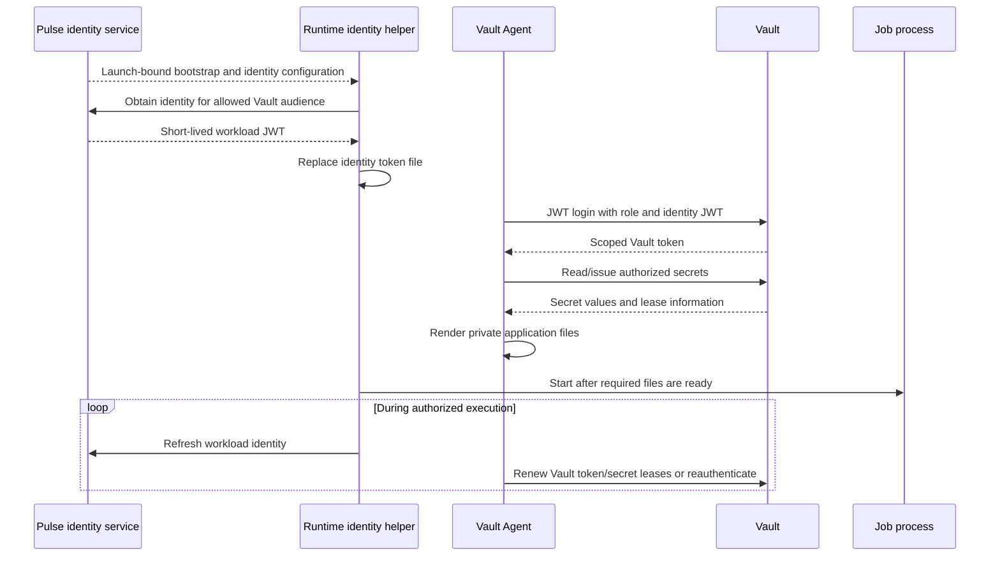

# Pulse integration with Vault and existing workload identity systems

Status: proposal for review; no implementation changes. Researched 2026-09-30 against official documentation and Pulse `fea09cb`. Pin and validate actual Vault/Agent versions before implementation; documentation links may track newer releases.

Companion: [Pulse-owned job credentials](pulse-owned-credentials-design.md).

## Recommendation

For deployments already operating Vault, make Pulse a workload identity issuer and use Vault's existing JWT authentication API plus Vault Agent for secret retrieval and file rendering. Pulse establishes which execution is running; Vault controls which secrets that identity can access and manages supported secret leases.

This is a practical form of option 3. It replaces a new general-purpose secret broker with an existing system, but still requires Pulse to deliver and refresh job identity and to define the relationship between job completion and downstream credentials.

Keep direct gitvend signing as an independent adapter. Vault's JWT login authenticates a workload to Vault; it does not automatically issue a gitvend-compatible JWT. Moving gitvend's private key into Vault Transit changes key custody, but does not remove the need for a component that constructs and authorizes gitvend grants.

## What existing systems establish

| System | Existing approach | Lesson for Pulse |
| --- | --- | --- |
| Nomad + Vault | A task's workload identity is exchanged for a task-specific Vault token; clients handle renewal. | Closest architectural precedent: scheduler identity, Vault authorization, runtime delivery. |
| GitHub Actions OIDC | A job presents a signed identity token to a configured external trust relationship. | Avoid distributing one shared cloud/secret-store credential to every job. |
| Kubernetes projected service-account tokens | Audience-specific, expiring tokens are projected into pods and rotated by the kubelet. | Stable file paths and a trusted runtime refresh loop are useful independently of Kubernetes. |
| SPIFFE/SPIRE | Workloads obtain identity through a local Workload API, with workload attestation handled by the implementation. | Prefer an existing local identity facility on runner fleets that already have one. |

Sources: [Nomad Vault ACL integration](https://developer.hashicorp.com/nomad/docs/secure/vault/acl), [Nomad Vault integration](https://developer.hashicorp.com/nomad/docs/secure/vault), [GitHub Actions OIDC](https://docs.github.com/en/actions/concepts/security/openid-connect), [Kubernetes service-account token projection](https://kubernetes.io/docs/tasks/configure-pod-container/configure-service-account/), [SPIFFE Workload API usage](https://spiffe.io/docs/latest/deploying/svids/).

These are architectural precedents, not evidence that the platforms can enforce Pulse's job/launch identity without additional configuration. A shared node or cloud service identity usually identifies a broader principal than one Pulse execution.

## Which parts are standards?

Separate the token format, discovery mechanism, and exchange endpoint:

| Layer | Reusable mechanism | Pulse implication |
| --- | --- | --- |
| Signed identity | JWT/JWS with an issuer, audience, subject, expiry, and key ID | Define a stable Pulse execution-identity claim profile. |
| Public-key discovery | JWKS; optionally OIDC discovery | Publish verification keys with rotation overlap. |
| Vault login | `POST /v1/auth/<mount>/login` with `role` and `jwt` | Use Vault's existing API; no new broker exchange protocol needed for Vault. |
| OAuth token exchange | RFC 8693 | An available standard for services that implement it, not the wire protocol of Vault JWT login. |
| Application secret delivery | Agent templates, token files, SDK credential providers | Select an existing consumer interface where possible. |

Vault can validate JWTs using configured public keys, a JWKS URL, or OIDC discovery. Machine authentication can use a JWT role directly; Pulse need not implement browser login, authorization-code flows, or a general identity provider to integrate with Vault. [Vault JWT authentication](https://developer.hashicorp.com/vault/docs/auth/jwt)

RFC 8693 standardizes exchanging a security token for another token. It does not itself define Pulse's authorization rules, job attestation, secret file delivery, or cancellation propagation. Do not label a custom endpoint “OAuth token exchange” unless it implements that specification. [RFC 8693](https://www.rfc-editor.org/rfc/rfc8693)

## Integration choices

| Approach | What Pulse holds/does | Advantages | Costs and limitations |
| --- | --- | --- | --- |
| **A. Workload JWT → Vault login** | Signs job identities; runtime exchanges them for Vault tokens. | Pulse need not read application secrets; standard Vault Agent integration. | Identity refresh and downstream cancellation still need a design. Recommended default. |
| **B. Wrapped per-job Vault token** | Authenticates to Vault and requests a narrowly scoped token, delivered through response wrapping. | No Pulse JWKS service required; Pulse can retain a token accessor for revocation. | Pulse needs token-issuance authority; bootstrap expires in queues; parent-token lifecycle matters. |
| **C. Native runtime identity → Vault login** | Selects an approved runtime identity and configures Vault access. | Can avoid a Pulse bootstrap secret and identity refresh service. | Provider-specific; a shared role/account does not establish individual job scope. |
| **D. Pulse fetches Vault secrets and injects values** | Reads secrets centrally and delivers them. | Easiest static-secret bridge. | Pulse sees every value and owns delivery/refresh; limited benefit over Pulse-owned issuance. |

A and C are the clearest separation of responsibilities. B is useful when the required lifecycle is a single bounded token with centralized revocation. D is a migration tool for short-lived jobs, not the preferred long-running architecture.

## A. Pulse-issued workload identity

### Claims and trust

Issue a dedicated identity JWT for Vault with a short lifetime, for example two minutes. Use a separate signing key and audience from gitvend credentials. Suggested claims:

```json
{
  "iss": "https://pulse-identity.example.com",
  "aud": "vault:production",
  "sub": "pulse:production:acme:j_123:l_456",
  "jti": "unique-token-id",
  "iat": 1801267200,
  "nbf": 1801267200,
  "exp": 1801267320,
  "pulse_instance": "production",
  "pulse_tenant": "acme",
  "pulse_job": "j_123",
  "pulse_launch": "l_456",
  "pulse_access_profile": "api-worker"
}
```

The timestamps are illustrative. Claims describe trusted authorization context, not arbitrary recipe input. Canonicalize identifiers and delimiters; an encoded subject must be unambiguous. A unique per-launch subject improves isolation but can create high-cardinality Vault identity records, so include cleanup and load testing in the operational design.

The runtime cannot select arbitrary audiences or access profiles. Bind its bootstrap/session to the allowed identity audiences and the authorized launch. Reuse the [grant/session lifecycle](pulse-owned-credentials-design.md#bootstrap-and-authenticated-renewal-api) from the Pulse-owned design, but return an identity JWT instead of the actual application secret.

Expose a JWKS containing public keys only. Keep private keys outside providers and runtimes. Vault's trust configuration must constrain the issuer, accepted algorithms, audience, and claims. Knowledge of the role name does not grant access; every role accepting Pulse identities must enforce appropriate bindings.

### Login and runtime flow



Agent's JWT auto-auth reads a JWT from a file and submits it to Vault. Configure `remove_jwt_after_reading = false` when Pulse maintains that file. Agent handles Vault authentication; it does not ask Pulse to create new identity tokens. A Pulse helper or trusted runner must do that separately. [Vault Agent JWT auto-auth](https://developer.hashicorp.com/vault/docs/agent-and-proxy/autoauth/methods/jwt)

Do not require arbitrary workload code to understand Vault. Run Agent as a supported sidecar or sibling helper under the runtime supervisor, and start c2j after required files have rendered. Define a readiness check and failure channel; file existence alone is inadequate if it might be left over from an earlier execution.

### Illustrative Vault policy and role

The following is a review sketch for one access profile, not a deployment script. Mount setup, TLS trust, keys, and secret data are omitted. Pulse credentials configuration is also proposed rather than implemented.

JWT auth mount configuration:

```json
{
  "jwks_url": "https://pulse-identity.example.com/.well-known/jwks.json",
  "bound_issuer": "https://pulse-identity.example.com",
  "jwt_supported_algs": ["RS256"]
}
```

Role at `auth/pulse/role/api-worker`:

```json
{
  "role_type": "jwt",
  "bound_audiences": ["vault:production"],
  "user_claim": "sub",
  "bound_claims": {
    "pulse_instance": "production",
    "pulse_tenant": "acme",
    "pulse_access_profile": "api-worker"
  },
  "token_policies": ["pulse-acme-api-worker"],
  "token_no_default_policy": true,
  "token_type": "service",
  "token_ttl": "5m",
  "token_explicit_max_ttl": "5m"
}
```

Policy for this example:

```hcl
path "kv/data/acme/api/runtime" {
  capabilities = ["read"]
}
path "auth/token/lookup-self" {
  capabilities = ["read"]
}
path "auth/token/renew-self" {
  capabilities = ["update"]
}
path "auth/token/revoke-self" {
  capabilities = ["update"]
}
```

Runtime Agent configuration fragment:

```hcl
vault {
  address = "https://vault.example.com"
}
auto_auth {
  method "jwt" {
    mount_path = "auth/pulse"
    config = {
      path                     = "/run/pulse/identity/vault.jwt"
      role                     = "api-worker"
      remove_jwt_after_reading = false
    }
  }
}
template {
  destination          = "/run/pulse/secrets/api-token"
  perms                = "0600"
  error_on_missing_key = true
  contents             = "{{ with secret \"kv/data/acme/api/runtime\" }}{{ .Data.data.api_token }}{{ end }}"
}
```

Role fields and login use the existing [Vault JWT API](https://developer.hashicorp.com/vault/api-docs/auth/jwt). This example intentionally grants a fixed profile path, not per-job isolation of that static secret. For per-job paths, use verified identity metadata in a reviewed policy template or provision a narrower role. Prevent wildcard/path injection. Avoid giving Pulse blanket permission to create arbitrary Vault policies during normal scheduling.

RS256 is used here for a broadly interoperable identity profile; gitvend's EdDSA key remains separate. The helper and Agent UID/file permissions must allow Agent to read identity and the application to read only its rendered files. Omit a Vault token sink unless a consumer needs it; keeping the Vault token out of the application does not remove same-UID or container-root access risks.

### Renewal has three independent clocks

| Clock | Managed by | What expiry means |
| --- | --- | --- |
| Pulse workload JWT | Pulse + identity helper | It can no longer authenticate a new Vault login. |
| Vault authentication token | Vault + Agent | It can no longer authorize Vault requests; associated lease consequences follow Vault semantics. |
| Issued application credential | Secret engine, upstream system, and consumer | Depends on that credential's native expiry/revocation behavior. |

Agent renews authentication tokens until renewal is denied and then reauthenticates as needed. Secret templating has separate behavior for renewable leases, nonrenewable secrets, and static values. A generic “refresh every N minutes” loop would duplicate functionality Vault already implements. [Vault auto-auth](https://developer.hashicorp.com/vault/docs/agent-and-proxy/autoauth), [Agent template renewal](https://developer.hashicorp.com/vault/docs/agent-and-proxy/agent/template)

The five-minute explicit maximum in the example forces a new login rather than indefinite renewal. That is a deliberate availability-versus-revocation tradeoff. Service tokens support renewal and individual revocation; batch tokens are lighter but do not offer those same lifecycle controls. Prefer service tokens when tracking and revoking individual job sessions matters; evaluate batch tokens for high-volume, bounded work. [Vault token types and lifetimes](https://developer.hashicorp.com/vault/docs/concepts/tokens)

**Inference for Pulse:** an expired Pulse JWT does not retroactively invalidate a Vault token issued from it. A JWT with two minutes remaining can be used just before expiry to obtain a new five-minute Vault token. Stopping identity refresh can therefore leave about seven minutes of Vault access, plus configured clock leeway, in this example. Standard JWT login is not a one-time redemption protocol; a `jti` alone does not prevent repeated logins.

Similarly, a `pulse_not_after` custom claim would not automatically cap a Vault token at that absolute time. Strict job-deadline enforcement needs an exchange component that enforces the remaining duration, a suitable custom auth integration, or trusted downstream revocation. Fixed role TTLs alone provide bounded residual access, not exact alignment with the execution deadline.

### Cancellation and static secrets

Stop Pulse identity issuance on trusted completion/cancellation. Agent can attempt self-revocation on clean shutdown. For stronger control, record Vault token accessors and revoke them from a trusted lifecycle service; accessors identify tokens without revealing their bearer values. [Vault token accessors](https://developer.hashicorp.com/vault/docs/concepts/tokens)

Direct JWT login complicates complete revocation: a workload that possesses the JWT can create additional Vault tokens without reporting their accessors. Registering only the Agent's first accessor is not sufficient. A trusted runner that keeps identity material outside workload access, mediated login, or a custom integration is needed for a complete issuance inventory. Otherwise publish the bounded residual-access guarantee and rely on short downstream lifetimes.

Dynamic secret engines can revoke supported leased credentials when leases expire or are revoked. This is distinct from a KV-stored API token: denying further reads does not revoke a copy already delivered. Static tokens must be rotated/revoked at their upstream service. Upstream outages can also delay lease revocation, so do not claim universal instantaneous cancellation. [Vault lease lifecycle](https://developer.hashicorp.com/vault/docs/concepts/lease)

## B. Wrapped per-job Vault tokens

Pulse can authenticate to Vault with its own restricted controller identity and request a job token through a tightly constrained token role. Ask Vault to wrap the response and pass only the wrapping token to the execution. The runtime unwraps it once and uses the contained job token.

Response wrapping provides a short-lived, single-use handle to a response, with an independent wrapping TTL and creation-path metadata. The wrapper remains a bearer credential: an interceptor can unwrap first. It is not workload attestation. [Vault response wrapping](https://developer.hashicorp.com/vault/docs/concepts/response-wrapping)

For Pulse, this means:

- Scope the controller to approved token roles/policies, never arbitrary token creation.
- Choose and document child versus orphan behavior: revoking a parent may revoke its children; orphaning trades that linkage for separate lifecycle responsibility.
- Retain the created job token accessor through a trusted mechanism if cancellation requires revocation. A wrapped response hides its contents from Pulse as well, so accessor capture is a separate integration requirement.
- Keep wrapped-token redemption out of provider admission. Queues require a wrapping TTL that covers activation, and an ambiguous unwrap response is not safely retried as if nothing happened.
- Use a bounded token lifetime. At its maximum TTL the runtime needs a new authorized introduction; wrapping is delivery, not renewable workload identity.

An AppRole RoleID plus a wrapped, short-lived SecretID is another existing bootstrap path. It can help environments without JWT federation, but introduces SecretID issuance and lifecycle; shared AppRole credentials do not provide per-job isolation automatically. [Vault AppRole authentication](https://developer.hashicorp.com/vault/docs/auth/approle)

Prefer A when Pulse can operate an identity service. Prefer B for deployments that want controlled token issuance with existing Vault machinery and can tolerate one bounded authorization period or a mediated replacement flow.

## Gitvend: what Vault can and cannot replace

Gitvend expects its own signed grant format, including an EdDSA signature and specific header/claims. A Vault login token is not a gitvend credential. A Pulse identity JWT intended for Vault is not one either. [Gitvend token contract](https://github.com/colony-2/gitvend/blob/9f3d2173731a511edeb0c80a51f01f83df2d62f1/README.md#issue-an-agent-credential)

Three viable arrangements:

| Arrangement | Signing key | Grant authorization and JWT construction | Assessment |
| --- | --- | --- | --- |
| Pulse signs directly | Pulse | Pulse | Straightest path for the immediate gitvend requirement. |
| Pulse uses Vault Transit | Vault | Pulse | Improves key custody while retaining option 2's ownership model. |
| Dedicated gitvend issuer/plugin | Issuer or Vault | Issuer/plugin | Option 3 for gitvend, but requires custom implementation. |

Transit supports Ed25519 signing. A Pulse adapter would construct gitvend's signing input, request a signature, translate Vault's versioned signature representation into the required JWS representation, and map key versions to gitvend `kid` values/public keys. Verify exact Ed25519 rather than Ed25519ph compatibility. Transit supplies a cryptographic operation, not gitvend grant-policy validation. [Vault Transit signing API](https://developer.hashicorp.com/vault/api-docs/secret/transit)

Do not grant workloads direct access to the general-purpose Transit signing key: that would let them submit signing inputs containing broader Git permissions. Only the trusted issuer should call it after grant validation.

Storing the private key in KV and fetching it into Pulse is also possible, but Pulse still holds the plaintext key. Storing finished JWTs in KV merely relocates delivery; something still has to mint and replace them. Vault's identity/OIDC issuance should not be assumed compatible with gitvend's strict token schema without explicit compatibility work.

A custom secrets-engine plugin could expose a gitvend issuance endpoint, but lease revocation would still not invalidate already-issued stateless gitvend JWTs without gateway changes. Prefer direct Pulse signing or Transit first; build a plugin only if shared external ownership of grant policy justifies it.

## Other existing systems and portability

**Cloud federation:** AWS STS accepts web identity tokens and issues temporary AWS credentials. Its documented JWT signature algorithms are RSA and ECDSA, so reusing gitvend's Ed25519 profile would not work there. Audience, subject conditions, session duration, and role policy must be configured at AWS. [AWS AssumeRoleWithWebIdentity](https://docs.aws.amazon.com/STS/latest/APIReference/API_AssumeRoleWithWebIdentity.html)

Google Cloud Workload Identity Federation is another target for trusted external identities. Use its configured attribute mappings/conditions and supported credential tooling rather than teaching Pulse to distribute long-lived service-account keys. [Google Cloud federation](https://docs.cloud.google.com/iam/docs/workload-identity-federation)

These integrations can share Pulse's execution identity model, but need target-specific audience, algorithm, discovery, and exchange adapters. Implement the OIDC discovery profile required by each relying party; publishing only a JWKS is not equivalent to a universally compatible OIDC issuer.

**Native platform identity:** a provider can assign an approved task role or service account and let Agent/SDKs obtain credentials through that platform. Enforce job-specific access through a sufficiently narrow identity assignment or a verified second-stage job grant. Never infer the job from an untrusted environment variable accompanying a shared cloud identity.

**SPIFFE/SPIRE:** useful on an existing runner fleet where a trusted agent can attest the workload and expose the Workload API. Pulse would supply identity registration/selection context and grant policy; SPIRE would manage identity issuance/rotation. Do not introduce that infrastructure just to deliver the first gitvend token, and do not assume its local socket is available in managed serverless jobs. [SPIFFE identity delivery](https://spiffe.io/docs/latest/deploying/svids/)

## Runtime delivery and Pulse integration

Prefer Agent-rendered files for long-running jobs. Vault Agent also supports injecting environment variables through process-supervisor mode, but changing those values requires starting a new child process; its secret-change restart policy defaults to `always`. For c2j, automatic process restart is a job-lifecycle decision and must not happen implicitly on secret rotation. Use file reload where supported, or explicitly configure and document the restart behavior. [Vault Agent process supervisor](https://developer.hashicorp.com/vault/docs/agent-and-proxy/agent/process-supervisor)

Agent fetches/rendering and application uptake are distinct: writing a new file does not force a database client, API client, or shell to reload it. Define a consumer contract per binding. Gitvend's credential helper already rereads its token file on credential requests, which is a suitable contract.

The shared Pulse changes are similar to the direct-issuer design:

| Area | Required change |
| --- | --- |
| Configuration | Named identity audiences, access profiles, Vault role/mount references, and explicit file/env bindings. |
| Authorization | Trusted mapping from tenant/job/launch to profiles; optional authoritative c2j ownership gating. |
| Identity service | Signed tokens, key publication/rotation, authenticated acquisition, bounded session state. |
| Runtime | Identity-file refresh plus Agent lifecycle, readiness, signal handling, and expiry policy. |
| Providers | Explicit support for helpers/sidecars, private ephemeral storage, and protected bootstrap or native identity. |
| Remote protocol | Versioned/capability-gated additions; preserve existing immutable launch semantics. |
| Operations | Identity and Vault availability, audit correlation, token/entity cleanup, and revocation guarantees. |

The cloud adapters currently do not implement a general Agent/sidecar contract. Start with a compatible image/supervisor arrangement and one provider, then add explicit capabilities. Account for helper resources and startup time. Registry image-pull credentials remain provider-side because Agent cannot run before its image is pulled.

The same launch-versus-lease distinction applies here: issuing a workload JWT proves Pulse authorized an execution, not that c2j currently owns the job. Vault cannot infer exclusive ownership from that JWT unless a trusted integration asserts and maintains it.

## Availability and validation

Existing Vault tokens and locally rendered secrets can tolerate some Pulse identity-service downtime, but reauthentication eventually requires fresh identity. Vault outages affect new logins, reads, and renewal; stale files are not permission to use expired credentials. Configure required-secret failure handling with the outer process supervisor. Avoid indefinite renewal profiles that accidentally sever authorization from job lifetime.

JWKS key rotation needs overlap, reachable verification endpoints, and tests against the selected Vault version's caching/refetch behavior. Vault should not have to contact the scheduler for every secret read, and the scheduler should not proxy secret bodies in approach A.

Acceptance work should include:

1. Wrong issuer/audience/tenant/profile denial and inability to select a broader Vault role.
2. Identity refresh, Agent reauthentication, dynamic lease renewal, and consumer file reload across several lifetimes.
3. Pulse and Vault outages, clock skew, expiry near a job deadline, and planned key rotation.
4. Multiple logins with one JWT and measured residual access after cancellation; verify any accessor-based revocation claim against this case.
5. Provider queueing/fallback/unknown outcomes, duplicate launches, and c2j handoff without scope expansion.
6. Static-secret behavior after Vault token revocation, upstream dynamic-secret revocation failure, and absence of values in Pulse diagnostics.
7. Live gitvend verification of a Transit-produced JWT if that adapter is chosen.

The configuration fragments have been checked for syntax as review material; no live Vault, cloud federation, or gitvend integration is claimed by this document.

## Suggested path

For the immediate gitvend use case, implement the direct Pulse issuer and runtime file binding described in the companion proposal. Keep the grant/session and signing interfaces narrow enough to substitute Transit later.

For teams already using Vault, add a Pulse workload-identity adapter with JWT login and Vault Agent. Reuse existing Vault policy and lease behavior. Choose between bounded residual access and stricter mediated login/revocation before presenting cancellation guarantees.

Review decisions are whether Vault is already an operated dependency, whether Pulse identities must also federate to clouds, whether credentials need exact execution-deadline enforcement, and whether a trusted runner can hold bootstrap/identity material outside job access. Those choices determine how much of the lifecycle Pulse must retain even when Vault owns the secrets.
